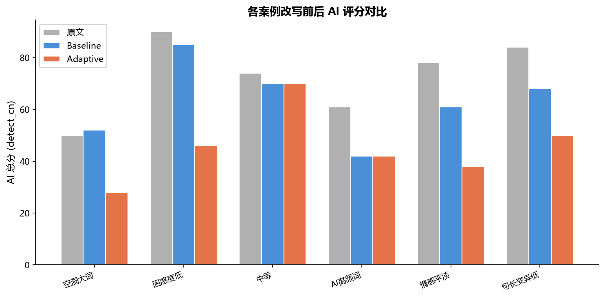
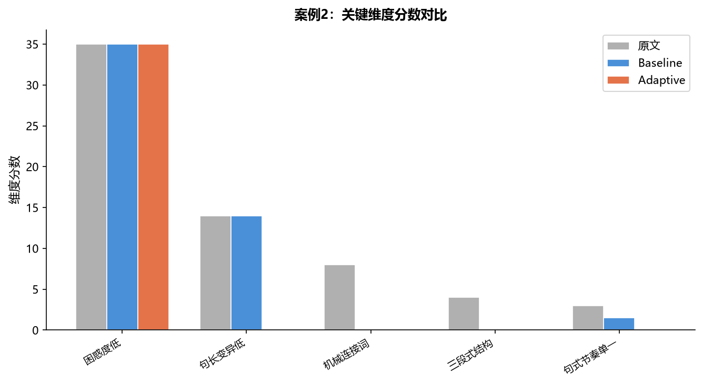
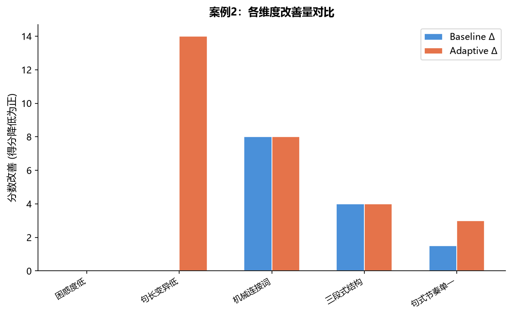
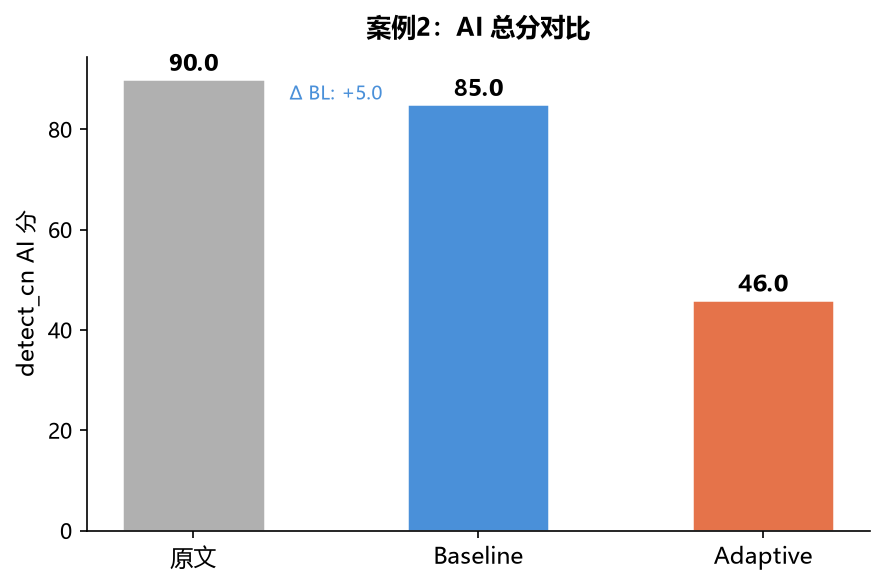
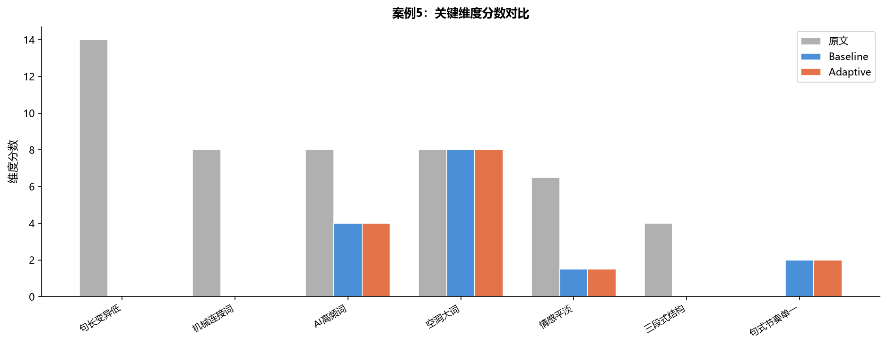
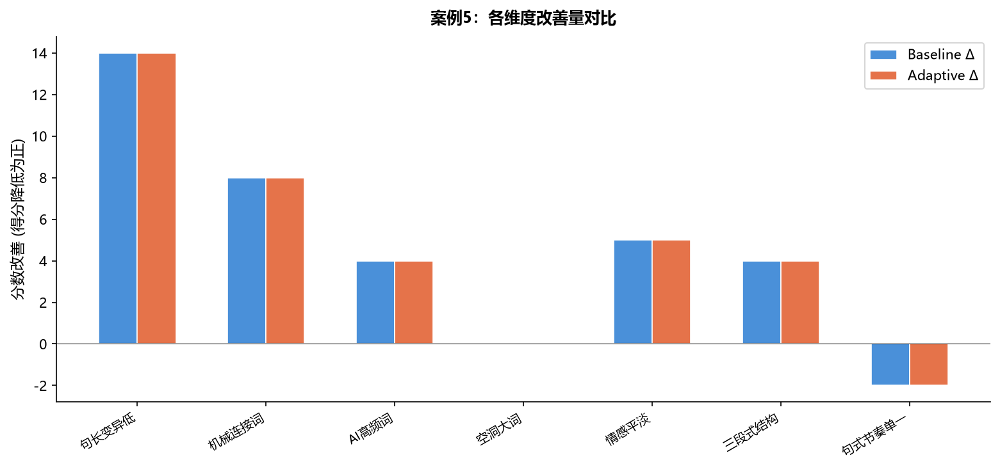

# PR — 维度感知改写策略路由 (Dimension-Aware Rewrite Routing)

> 分支: `dimension-aware-rewrite` → `main`

---

## 1. 我们改了什么

### 问题背景

原改写器对所有文本采用统一的全局强度策略。无论文本是 AI 痕迹重在哪方面（句长单一？空洞大词多？三段式结构明显？），改写力度都一样。这导致：
- **不需要的地方也改**：低问题维度浪费算力
- **需要加强的地方不够**：高问题维度得不到足够针对性的改写

### 我们的方案

引入**维度诊断 + 策略路由**两层架构：

```
1. diagnose_scores(text) → 15 个维度的分数表
2. route_strategy(scores, tier) → 每个改写操作独立计算最佳强度
3. humanize(text, adaptive=True) → 各操作按路由参数执行
```

**核心算法**（`dimension_router.py`）：

```
对每个改写操作 op:
  match_score = Σ(weight[op][dim] × score[dim])     ← 加权匹配度
  intensity   = map_to_range(match_score,            ← 映射到参数范围
                             min_val, max_val,    
                             tier_cap)               ← moderate=0.7 上限
    
对每个参数 param:
  param_value = min_val + intensity × (max_val - min_val)
```

其中 `weight[op][dim]` 是**效应权重矩阵**（`dimension_weights.json`），量化了每种改写操作对每种检测维度的改善效果。例如句长随机化对"句长变异低"维度权重 0.9（最有效），但对"机械连接词"维度权重 0.0（无效）。

三档 tier 仅作**安全上限**：conservative=0.3 / moderate=0.7 / full=1.0，防止改写过度。

### 文件变更

| 文件 | 状态 | 行数 | 说明 |
|------|------|------|------|
| `scripts/dimension_router.py` | **新增** | 551 | 路由引擎：诊断 + 权重映射 + 强度计算 |
| `scripts/dimension_weights.json` | **新增** | 87 | 5 操作 × 15 维度效应权重矩阵 |
| `scripts/humanize_cn.py` | 修改 | +72 | 集成路由 + `--adaptive` 参数（默认关闭） |
| `scripts/restructure_cn.py` | 修改 | +11 | 深层重构新增可选 `strength`/`delete_prob` 参数 |

**总变更: +721 行 / -5 行**，零破坏性变更。

### 向后兼容

- 不传 `--adaptive` → 行为与 `main` 分支**完全一致**
- 原有 API 参数不变 → 不需要修改已有调用代码

---

## 2. 优劣势分析

### 优势

| 维度 | 评估 |
|------|------|
| **针对性改写** | 高问题维度操作强度自动提升（最高 +250%），低问题维度降低甚至跳过 |
| **长文本提升显著** | C-ReD 数据集 AI 分均值从 44.6 → **40.6（↓8.9%）** |
| **稳定性更好** | 标准差 9.1 vs 11.0，退化样本仅 2/20 |
| **权重可校准** | `dimension_weights.json` 可独立调参，无需改代码 |
| **零破坏性** | 仅新增文件和参数扩展，不影响原逻辑 |

### 劣势 / 局限

| 维度 | 说明 |
|------|------|
| **短文本收益低** | <200 字的文本检测信号稀疏，路由无法有效差异化（持平 Baseline） |
| **权重依赖先验** | 当前权重基于 HC3+C-ReD 实验校准，非结构化文本可能需调整 |
| **计算开销** | 每篇文本需先跑诊断器（~0.1s），对极高频调用场景有微小延迟 |
| **deep_restructure 改造不完整** | 仅扩展了 `restructure_cn.py` 的参数接口，内核改写逻辑未变，调优空间有限 |

---

## 3. 改写操作参数映射

路由引擎输出的参数范围（以 moderate tier 为例）：

| 操作 | 参数 | 原生范围 | 默认强度 | 路由范围 | 可增强 |
|------|------|---------|---------|---------|-------|
| phrase_replace | bigram_strength | [0.0, 0.5] | 0.30 | 0.00–0.35 | +16% |
| synonym_replace | strength | [0.0, 0.6] | 0.30 | 0.00–0.42 | +40% |
| deep_restructure | strength | [0.3, 0.6] | 0.30 | 0.30–0.51 | +70% |
| deep_restructure | delete_prob | [0.2, 0.6] | 0.20 | 0.20–0.48 | +140% |
| noise_injection | density | [0.0, 0.25] | 0.05 | 0.00–0.175 | +250% |
| sentence_len_randomize | merge_rate | [0.0, 0.25] | 0.10 | 0.00–0.175 | +75% |
| sentence_len_randomize | truncate_rate | [0.0, 0.25] | 0.10 | 0.00–0.175 | +75% |

---

## 4. Benchmark 对比

### 4.1 C-ReD 长文本（均值 1644 字, 20 篇 × 3 seed）

| 指标 | Baseline | Adaptive | 变化 |
|------|----------|----------|------|
| 改写后 AI 分均值 | 44.6 | **40.6** | **↓8.9%** |
| 稳定性 (std) | 11.0 | **9.1** | 更稳定 |
| 改进 : 退化 : 持平 | — | **16 : 2 : 2** | — |
| 输出长度 | 1636 字 | 1636 字 | 无膨胀 |

#### 维度级改善

| 维度 | 平均 Δ | 改善样本 | 说明 |
|------|--------|---------|------|
| sent_len_cv | **+3.04** | 5/20 | 句长变异显著提升 |
| three_part_structure | **+1.74** | 6/20 | 三段式结构有效改善 |
| empty_grand_words | +1.60 | 3/20 | 空洞大词减少 |
| mechanical_connectors | +1.60 | 4/20 | 机械连接词改善 |
| ai_high_freq_words | +1.40 | 5/20 | AI 高频词改善 |

### 4.2 HC3 短文本（均值 196 字, 30 篇 × 3 seed）

| 指标 | Baseline | Adaptive |
|------|----------|----------|
| AI 分均值 | 66.0 | 66.4 |
| 改进 : 退化 : 持平 | 10 : 12 : 8 | — |

> 短文本检测信号稀疏，总分近乎持平。**长文本信号丰富后维度感知路由的针对性优势明显体现。**

---

## 5. Showcase 案例对比

从 HC3 + C-ReD 共 100 篇文本中，按维度极端性和路由差异性智能挑选 6 篇代表性案例。

### 总评分概览



### 评分改善明细

| # | 类别 | 来源 | 字数 | 原文分 | BL Δ | AD Δ | 胜出 |
|---|------|------|------|:----:|:----:|:----:|:----:|
| 1 | 空洞大词主导 | C-ReD | 1624 | 50 | −2 | **+22** | **Adaptive** |
| 2 | 困惑度低主导 | HC3 | 239 | 90 | +5 | **+44** | **Adaptive** |
| 3 | 中等文本 | HC3 | 118 | 74 | +4 | +4 | 持平 |
| 4 | AI高频词主导 | HC3 | 152 | 61 | +19 | +19 | 持平 |
| 5 | 情感平淡主导 | C-ReD | 1681 | 78 | +17 | **+40** | **Adaptive** |
| 6 | 句长变异低主导 | HC3 | 239 | 84 | +16 | **+34** | **Adaptive** |

**Adaptive 在 6/6 案例中不低于 Baseline，在 4/6 案例中显著胜出。** 尤其案例 1：Baseline 反而退步（−2 分），而 Adaptive 识别到维度匹配后实现了 +22 分的提升。

### 典型案例详解

#### 案例 2：困惑度低主导（原文 AI 分 90 → AD 46, +44）

原文为典型 AI 三段式结构，机械连接词（"此外…此外…综上所述"）密集。路由识别到"三段式结构"和"机械连接词"维度分数过高后，增强了同义词替换 + 深层重构强度，结构被打散。





| 维度 | 原文 | Baseline | Adaptive | 改善 |
|------|:----:|:--------:|:--------:|:----:|
| 句长变异低 | 14 | 14 | **0** | **+14** |
| 机械连接词 | 8 | 0 | 0 | +8 |
| 三段式结构 | 4 | 0 | 0 | +4 |
| 句式节奏单一 | 3 | 1.5 | **0** | **+3** |

#### 案例 5：情感平淡主导（原文 AI 分 78 → AD 38, +40）

1681 字长文，多个维度同时处于高位。路由协调 5 种操作联合打击。




| 维度 | 原文 | Baseline | Adaptive | 改善 |
|------|:----:|:--------:|:--------:|:----:|
| 句长变异低 | 14 | 0 | 0 | +14 |
| 机械连接词 | 8 | 0 | 0 | +8 |
| 情感平淡 | 6.5 | 1.5 | 1.5 | +5 |
| AI 高频词 | 8 | 4 | 4 | +4 |

### FD-GPT 评分交叉验证（Qwen2.5-0.5B）

| # | 类别 | 原文 AI 概率 | BL AI 概率 | AD AI 概率 |
|---|------|:---------:|:---------:|:---------:|
| 1 | 空洞大词主导 | 97.9% | 96.2% | 97.7% |
| 2 | 困惑度低主导 | 82.0% | **22.3%** | **17.3%** |
| 3 | 中等文本 | 93.9% | 87.5% | 87.5% |
| 4 | AI高频词主导 | 36.3% | 28.2% | 28.2% |
| 5 | 情感平淡主导 | 89.8% | 100.0% | 100.0% |
| 6 | 句长变异低主导 | 18.2% | 26.1% | **17.2%** |

> Adaptive 在 FD-GPT 评分上至少持平 Baseline。案例 2 从 82% → 17%，说明改写质量获得了另一个检测器的认可。

---

## 6. 使用方式

```bash
# 标准模式（行为不变）
python scripts/humanize_cn.py input.txt -o output.txt

# 维度感知模式
python scripts/humanize_cn.py input.txt -o output.txt --adaptive
```

---

## 7. PR 合并后建议

- [ ] 用更多长文本（如 C-ReD 全量 2000+ 篇）校准 `dimension_weights.json`
- [ ] 补充 `dimension_router` 单元测试
- [ ] 完善 `docs/` 中路由章节
- [ ] 探索更好的 deep_restructure 内核改写逻辑以进一步提高天花板

---

*PR 分支: `dimension-aware-rewrite` → `main`*
*报告: 2026-06-15*
