# 维度感知改写 — Showcase 详细对比报告

生成时间: 2026-06-15 15:34:46

测试文本: HC3-Chinese + C-ReD 共 100 篇

种子: 42 | 改写档次: moderate (no best-of-n)

---

## 总体汇总

| # | 类别 | 来源 | 字数 | 原文AI | BL Δ | AD Δ | 胜出 |
|---|------|------|------|--------|------|------|------|
| 1 | 空洞大词主导 (AD胜出+24) | C-ReD | 1624 | 50 | -2 | +22 | Adaptive |
| 2 | 困惑度低主导 (AD胜出+39) | HC3 | 239 | 90 | +5 | +44 | Adaptive |
| 3 | 中等文本 (AD Δ=+4) | HC3 | 118 | 74 | +4 | +4 | 持平 |
| 4 | AI高频词主导 (持平) | HC3 | 152 | 61 | +19 | +19 | 持平 |
| 5 | 情感平淡主导 (AD胜出+23) | C-ReD | 1681 | 78 | +17 | +40 | Adaptive |
| 6 | 句长变异低主导 (AD胜出+18) | HC3 | 239 | 84 | +16 | +34 | Adaptive |

### 汇总：各案例 AI 总分对比


---

## 案例 1：空洞大词主导 (AD胜出+24)

- **来源**: C-ReD | **字数**: 1624 | **种子**: 42

- **原文 AI 分**: 50.0

- **Baseline 改写后**: 52.0 (Δ -2.0)

- **Adaptive 改写后**: 28.0 (Δ +22.0)

- **问题维度**: 空洞大词, AI高频词, 句式节奏单一, 短句占比低, 情感平淡

- **Tier**: moderate (cap=0.7)

### AI 总分对比

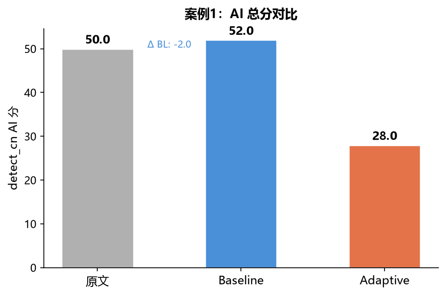

### 关键维度分数对比

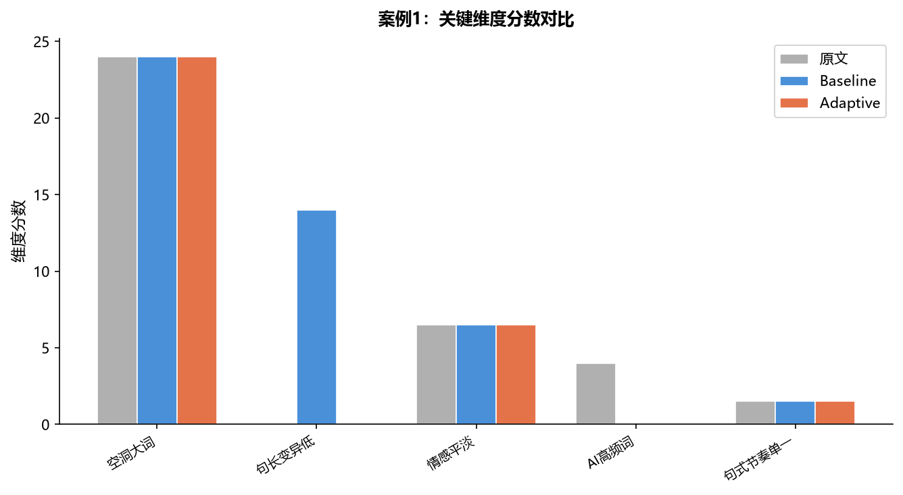

### 各维度改善量

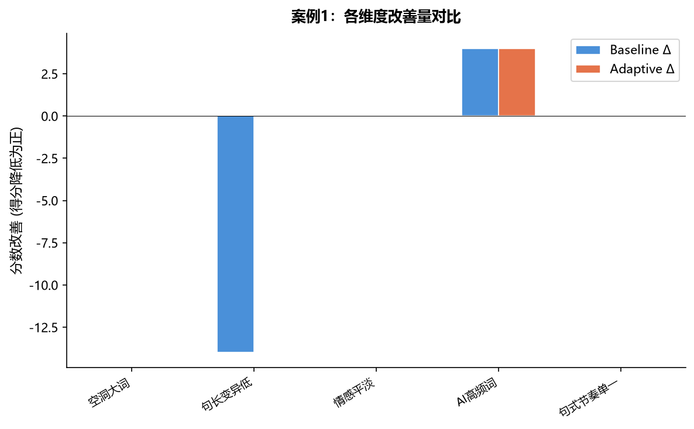

### Fast-DetectGPT (Qwen2.5-0.5B) 评分

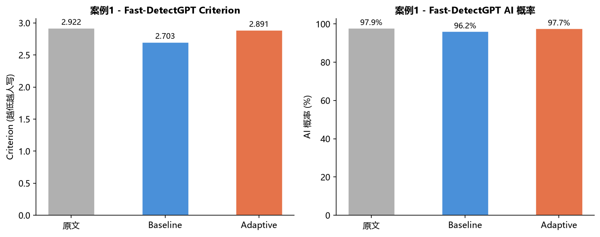

| 版本 | Criterion | AI 概率 |
|------|-----------|---------|
| 原文 | 2.9219 | 97.9% |
| Baseline | 2.7031 | 96.2% |
| Adaptive | 2.8906 | 97.7% |

### 路由策略参数

| 操作 | 参数 | 强度值 |
|------|------|--------|
| 短语替换 | bigram_strength | 0.3500 ███████░░░░░░░░░░░░░ |
| 同义词替换 | strength | 0.2160 ████░░░░░░░░░░░░░░░░ |
| 深层重构 | strength | 0.5100 ██████████░░░░░░░░░░ |
| 深层重构 | delete_prob | 0.4800 █████████░░░░░░░░░░░ |
| 噪声注入 | density | 0.1750 ███░░░░░░░░░░░░░░░░░ |
| 句长随机化 | merge_rate | 0.1750 ███░░░░░░░░░░░░░░░░░ |
| 句长随机化 | truncate_rate | 0.1750 ███░░░░░░░░░░░░░░░░░ |

### 维度分数明细

| 维度 | 原文 | Baseline | Adaptive | BL改善 | AD改善 |
|------|------|----------|----------|--------|--------|
| 空洞大词 | 24.0 | 24.0 | 24.0 | +0.0 | +0.0 |
| 句长变异低 | 0.0 | 14.0 | 0.0 | -14.0 | +0.0 |
| 情感平淡 | 6.5 | 6.5 | 6.5 | +0.0 | +0.0 |
| AI高频词 | 4.0 | 0.0 | 0.0 | +4.0 | +4.0 |
| 句式节奏单一 | 1.5 | 1.5 | 1.5 | +0.0 | +0.0 |

### 路由参数明细

| 操作 | bigram_strength | strength | delete_prob | density | merge_rate | truncate_rate |
|------|:-----------:|:------:|:--------:|:-----:|:--------:|:-----------:|
| 短语替换 | 0.35 | - | - | - | - | - |
| 同义词替换 | - | 0.216 | - | - | - | - |
| 深层重构 | - | 0.51 | 0.48 | - | - | - |
| 噪声注入 | - | - | - | 0.175 | - | - |
| 句长随机化 | - | - | - | - | 0.175 | 0.175 |

### 文本片段对比

**原文** (446字):

> 咀嚼“桑提亚哥”――读海明威《老人与海》月光像薄纱一样洒落在古巴海边，桑提亚哥拖着那条被啃噬得只剩下巨大骨架的马林鱼，慢慢走上沙滩。大鱼的骨架在月光下泛着惨白而坚硬的寒光，如同一座荒凉的凯旋门，也像一具被时间啃噬得只剩下精神的骨架标本。海明威笔下的桑提亚哥，正如同这具鱼骨，他血肉饱满的搏斗经历被“鲨鱼”撕咬殆尽，但恰恰是那被噬尽后的骨架，在月光下愈发显出一种清癯、坚硬的轮廓，以一种近乎残酷的方式，向我们袒露出人类精神的脊梁。桑提亚哥的“失败”，是一曲壮阔雄浑的英雄咏叹。八十四天一无所获，八十七天出海，历经日夜鏖战拖回的大鱼，最终只剩一副巨骨——这些冰冷的数字与结局，仿佛在为他刻下失败的墓志铭。然而，海明威以简洁如刀锋的笔触，剖开了失败的表层。老人那双被钓索勒得血肉模糊的手，那双像海水一样深蓝、带着永不屈服神采的眼睛，那一次次忍受剧痛依旧将鱼叉刺入鲨鱼头颅的执着——这一切都在无声宣告：他内在的城池从未陷落。老人与马林鱼的对峙与搏杀，是力与美的交响，是尊严与坚韧的史诗。当桑提亚哥最终说：“一个人可以被毁灭，但不能被打败”时，这句朴素箴言如金石般掷地有声。它宣告着真正的胜利——不是对马林鱼的

**Baseline** (449字):

> 咀嚼“桑提亚哥”――读海明威《老人与海》月光像薄纱一样洒落在古巴海边，桑提亚哥拖着那条被啃噬得只剩下巨大骨架的马林鱼，慢慢走上沙滩。大鱼的骨架在月光下泛着惨白而坚硬的寒光，如同一座荒凉的凯旋门，也像一具被时间啃噬得只剩下精神的骨架标本，海明威笔下的桑提亚哥，正如同这具鱼骨，他血肉饱满的搏斗经历被“鲨鱼”撕咬殆尽，但恰恰是那被噬尽后的骨架。在月光下愈发显出一种清癯、坚硬的轮廓，以一种近乎残酷的方式，向我们袒露出人类精神的脊梁。桑提亚哥的“失败”，是一曲壮阔雄浑的英雄咏叹。八十四天一无所获，八十七天出海，历经日夜鏖战拖回的大鱼，最终只剩一副巨骨—这些冰冷的数字与结局，仿佛在为他刻下失败的墓志铭。话又说回来，海明威以简洁如刀锋的笔触，剖开了失败的表层。老人那双被钓索勒得血肉模糊的手，那双像海水一样深蓝、带着永不屈服神采的眼睛，那一次次忍受剧痛依旧将鱼叉刺入鲨鱼头颅的执着—这一切都在无声宣告：他内在的城池从未陷落。老人与马林鱼的对峙与搏杀，是力与美的交响，是尊严与坚韧的史诗，当桑提亚哥最终说：“一个人可以被毁灭，但不能被打败”时，这句朴素箴言如金石般掷地有声。它宣告着真正的胜利—不是对马林鱼的

**Adaptive** (449字):

> 咀嚼“桑提亚哥”――读海明威《老人与海》月光像薄纱一样洒落在古巴海边，桑提亚哥拖着那条被啃噬得只剩下巨大骨架的马林鱼，慢慢走上沙滩。大鱼的骨架在月光下泛着惨白而坚硬的寒光，如同一座荒凉的凯旋门，也像一具被时间啃噬得只剩下精神的骨架标本，海明威笔下的桑提亚哥，正如同这具鱼骨，他血肉饱满的搏斗经历被“鲨鱼”撕咬殆尽，但恰恰是那被噬尽后的骨架。在月光下愈发显出一种清癯、坚硬的轮廓。以一种近乎残酷的方式，向我们袒露出人类精神的脊梁。桑提亚哥的“失败”，是一曲壮阔雄浑的英雄咏叹。八十四天一无所获，八十七天出海，历经日夜鏖战拖回的大鱼，最终只剩一副巨骨—这些冰冷的数字与结局，仿佛在为他刻下失败的墓志铭。话又说回来，海明威以简洁如刀锋的笔触，剖开了失败的表层。老人那双被钓索勒得血肉模糊的手，那双像海水一样深蓝、带着永不屈服神采的眼睛，那一次次忍受剧痛依旧将鱼叉刺入鲨鱼头颅的执着—这一切都在无声宣告：他内在的城池从未陷落。老人与马林鱼的对峙与搏杀，是力与美的交响，是尊严与坚韧的史诗，当桑提亚哥最终说：“一个人可以被毁灭，但不能被打败”时，这句朴素箴言如金石般掷地有声。它宣告着真正的胜利—不是对马林鱼的

---

## 案例 2：困惑度低主导 (AD胜出+39)

- **来源**: HC3 | **字数**: 239 | **种子**: 42

- **原文 AI 分**: 90.0

- **Baseline 改写后**: 85.0 (Δ +5.0)

- **Adaptive 改写后**: 46.0 (Δ +44.0)

- **问题维度**: 机械连接词, 三段式结构, 句式节奏单一, 句长变异低, 短句占比低, 困惑度低

- **Tier**: moderate (cap=0.7)

### AI 总分对比


### 关键维度分数对比


### 各维度改善量


### Fast-DetectGPT (Qwen2.5-0.5B) 评分

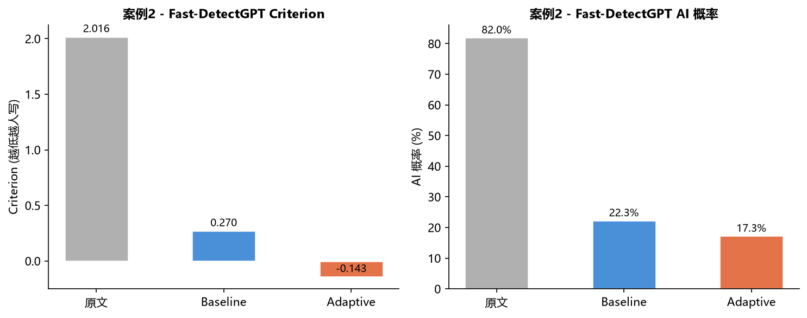

| 版本 | Criterion | AI 概率 |
|------|-----------|---------|
| 原文 | 2.0156 | 82.0% |
| Baseline | 0.2695 | 22.3% |
| Adaptive | -0.1426 | 17.3% |

### 路由策略参数

| 操作 | 参数 | 强度值 |
|------|------|--------|
| 短语替换 | bigram_strength | 0.3500 ███████░░░░░░░░░░░░░ |
| 同义词替换 | strength | 0.4200 ████████░░░░░░░░░░░░ |
| 深层重构 | strength | 0.5100 ██████████░░░░░░░░░░ |
| 深层重构 | delete_prob | 0.4800 █████████░░░░░░░░░░░ |
| 噪声注入 | density | 0.1750 ███░░░░░░░░░░░░░░░░░ |
| 句长随机化 | merge_rate | 0.1750 ███░░░░░░░░░░░░░░░░░ |
| 句长随机化 | truncate_rate | 0.1750 ███░░░░░░░░░░░░░░░░░ |

### 维度分数明细

| 维度 | 原文 | Baseline | Adaptive | BL改善 | AD改善 |
|------|------|----------|----------|--------|--------|
| 困惑度低 | 35.0 | 35.0 | 35.0 | +0.0 | +0.0 |
| 句长变异低 | 14.0 | 14.0 | 0.0 | +0.0 | +14.0 |
| 机械连接词 | 8.0 | 0.0 | 0.0 | +8.0 | +8.0 |
| 三段式结构 | 4.0 | 0.0 | 0.0 | +4.0 | +4.0 |
| 句式节奏单一 | 3.0 | 1.5 | 0.0 | +1.5 | +3.0 |

### 路由参数明细

| 操作 | bigram_strength | strength | delete_prob | density | merge_rate | truncate_rate |
|------|:-----------:|:------:|:--------:|:-----:|:--------:|:-----------:|
| 短语替换 | 0.35 | - | - | - | - | - |
| 同义词替换 | - | 0.42 | - | - | - | - |
| 深层重构 | - | 0.51 | 0.48 | - | - | - |
| 噪声注入 | - | - | - | 0.175 | - | - |
| 句长随机化 | - | - | - | - | 0.175 | 0.175 |

### 文本片段对比

**原文** (239字):

> 武汉是中国的一座重要的工业城市，近年来一直保持着较快的发展趋势。武汉的工业基础较为雄厚，有许多大型工业企业和研发机构。随着中国经济的不断发展，武汉的工业发展前景非常看好。

此外，武汉还是一座重要的交通枢纽，位于长江中游，有着优越的地理位置。随着中国的“一带一路”建设的推进，武汉的交通建设也在不断发展，为城市的经济发展提供了更多的机会。

此外，武汉还是一座有着悠久历史文化的城市，拥有众多名胜古迹和文化遗产。武汉的旅游业发展也非常迅速，吸引了越来越多的游客前来旅游观光。

综上所述，武汉在工业、交通、旅游等方面都具有很大的发展潜力。

**Baseline** (256字):

> 武汉是中国的一座重要的工业城市，这几年一直保持着较快的发展趋势。眼下，武汉的工业发展前景非常看好。武汉的工业基础较为雄厚，有许多大型工业企业和研发机构。进展不小。

事情可能并不如表面所示那般简单，需要更细致地审视。

还有，武汉还是一座主要的交通枢纽，位于长江中游，有着优越的地理位置。随着中原的“一带一路”建设的推进，武汉的交通建设也在一再发展，为城市的经济推动提供了更多的机会。

加之，武汉仍旧一座享有悠久历史文化的都会，拥有众多名胜古迹和文化遗产。武汉的旅游业发展也不行迅速，吸引了越来越多的游客前来旅游观光。

说到底，武汉在工业、通畅、国旅等方面都具有很大的发展潜力。

**Adaptive** (232字):

> 武汉是中国的一座重要的工业城市，这几年一直保持着较快的发展趋势。武汉的工业基础较为雄厚。有许多大型工业企业和研发机构。眼下，武汉的工业发展前景非常看好。势头良好。

还有，武汉还是一座主要的交通枢纽，位于长江中游，有着优越的地理位置。随着中原的“一带一路”建设的推进，武汉的交通建设也在一再发展，为都会的经济进展提供了更多的机会。
加之，武汉还是一座有着悠久历史文化的城市，拥有众多名胜古迹和文化遗产，武汉的旅游业推进也万分迅速，吸引了愈加多的游客前来旅游观光。

说到底，武汉在工业、通畅、巡游等方面都具有很大的发展潜力。

---

## 案例 3：中等文本 (AD Δ=+4)

- **来源**: HC3 | **字数**: 118 | **种子**: 42

- **原文 AI 分**: 74.0

- **Baseline 改写后**: 70.0 (Δ +4.0)

- **Adaptive 改写后**: 70.0 (Δ +4.0)

- **Tier**: moderate (cap=0.7)

### AI 总分对比

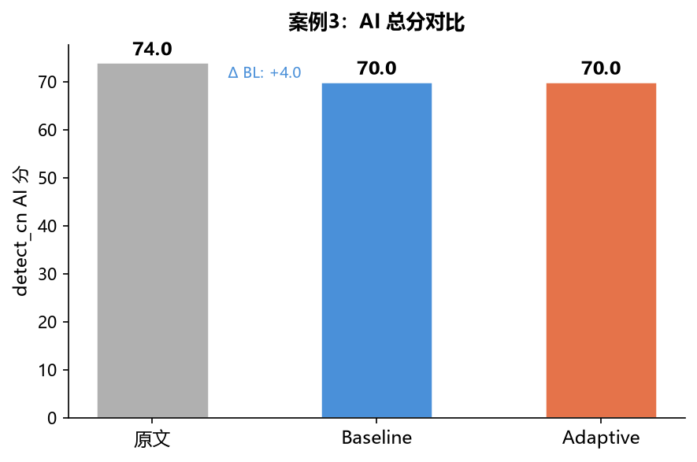

### 各维度改善量

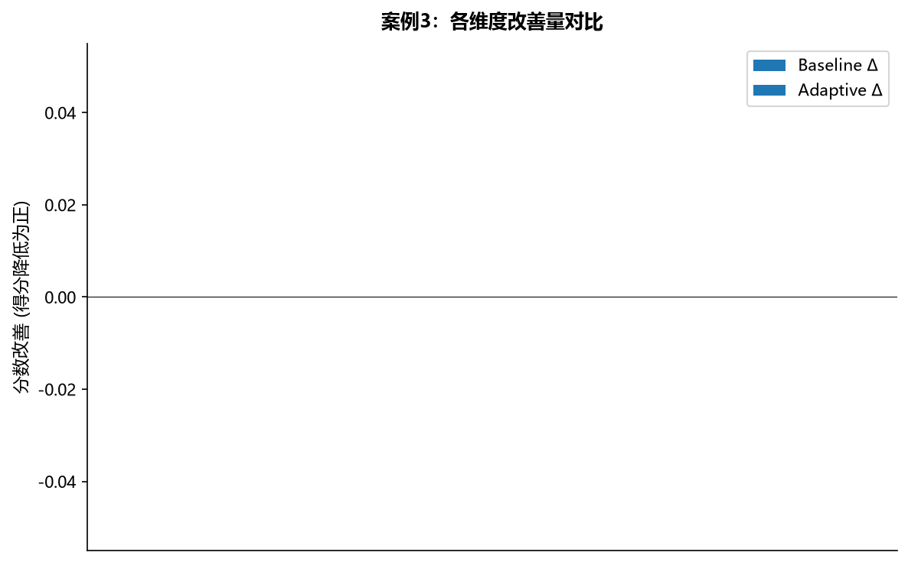

### Fast-DetectGPT (Qwen2.5-0.5B) 评分

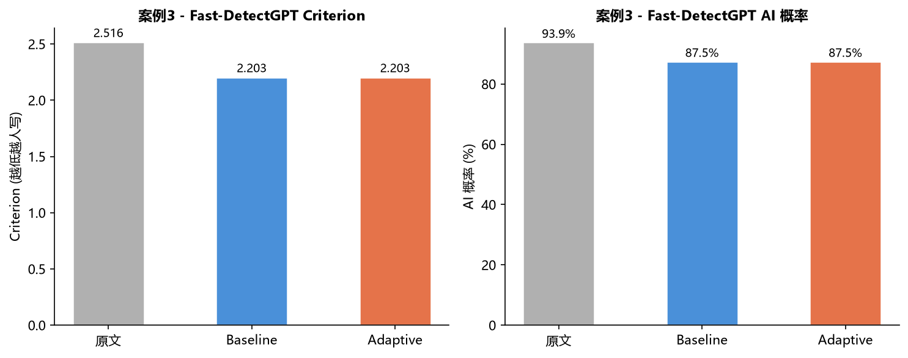

| 版本 | Criterion | AI 概率 |
|------|-----------|---------|
| 原文 | 2.5156 | 93.9% |
| Baseline | 2.2031 | 87.5% |
| Adaptive | 2.2031 | 87.5% |

### 路由策略参数

| 操作 | 参数 | 强度值 |
|------|------|--------|
| 短语替换 | bigram_strength | 0.0000 ░░░░░░░░░░░░░░░░░░░░ |
| 同义词替换 | strength | 0.0000 ░░░░░░░░░░░░░░░░░░░░ |
| 深层重构 | strength | 0.3000 ██████░░░░░░░░░░░░░░ |
| 深层重构 | delete_prob | 0.2000 ████░░░░░░░░░░░░░░░░ |
| 噪声注入 | density | 0.0000 ░░░░░░░░░░░░░░░░░░░░ |
| 句长随机化 | merge_rate | 0.0000 ░░░░░░░░░░░░░░░░░░░░ |
| 句长随机化 | truncate_rate | 0.0000 ░░░░░░░░░░░░░░░░░░░░ |

### 维度分数明细

| 维度 | 原文 | Baseline | Adaptive | BL改善 | AD改善 |
|------|------|----------|----------|--------|--------|

### 路由参数明细

| 操作 | bigram_strength | strength | delete_prob | density | merge_rate | truncate_rate |
|------|:-----------:|:------:|:--------:|:-----:|:--------:|:-----------:|
| 短语替换 | 0.0 | - | - | - | - | - |
| 同义词替换 | - | 0.0 | - | - | - | - |
| 深层重构 | - | 0.3 | 0.2 | - | - | - |
| 噪声注入 | - | - | - | 0.0 | - | - |
| 句长随机化 | - | - | - | - | 0.0 | 0.0 |

### 文本片段对比

**原文** (118字):

> 是的，如果您认为您购买的黄金是18K金但是实际上并不是，或者您对所购买的黄金有其他类似的疑虑，那么您可以考虑退换。然而，您需要向卖家提出退换要求，并且退换是否可以实现可能取决于卖家的退换政策以及您所购买的黄金的情况。建议您与卖家沟通，并在购买之前确认退换政策。

**Baseline** (117字):

> 是的，假如您认为您购买的黄金是18K金但是说真的并不是，或者您对所购买的黄金有其他类似的疑虑，那么您不妨看看退换。话又说回来，您需要向卖家提出退换要求。退换是否可以实现可能要看卖家的退换政策以及您所购买的黄金的情况。建议与卖家沟通，并在购买之前确认退换政策。

**Adaptive** (117字):

> 是的，假如您认为您购买的黄金是18K金但是说真的并不是，或者您对所购买的黄金有其他类似的疑虑，那么您不妨看看退换。话又说回来，您需要向卖家提出退换要求。退换是否可以实现可能要看卖家的退换政策以及您所购买的黄金的情况。建议与卖家沟通，并在购买之前确认退换政策。

---

## 案例 4：AI高频词主导 (持平)

- **来源**: HC3 | **字数**: 152 | **种子**: 42

- **原文 AI 分**: 61.0

- **Baseline 改写后**: 42.0 (Δ +19.0)

- **Adaptive 改写后**: 42.0 (Δ +19.0)

- **问题维度**: AI高频词, 句长变异低, 短句占比低, 逗号密度低

- **Tier**: moderate (cap=0.7)

### AI 总分对比

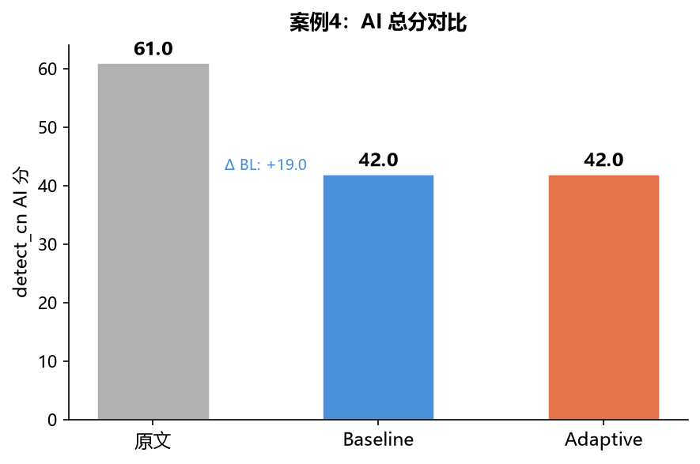

### 关键维度分数对比

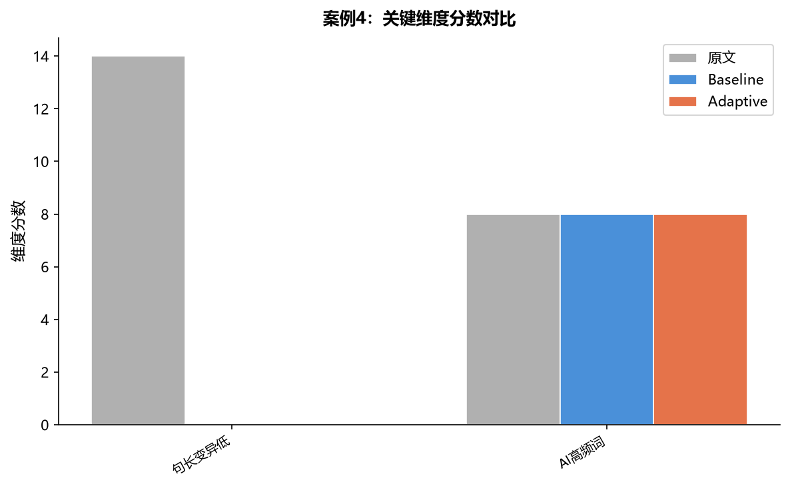

### 各维度改善量

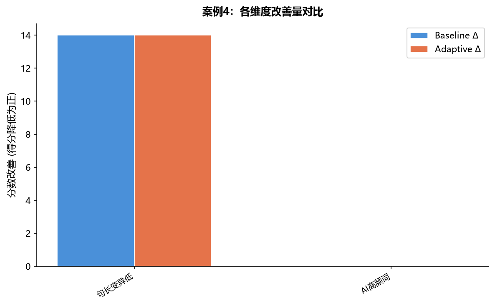

### Fast-DetectGPT (Qwen2.5-0.5B) 评分

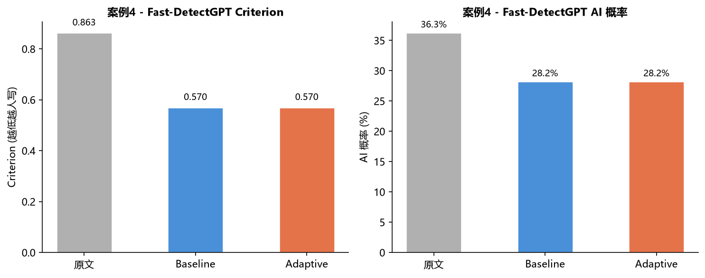

| 版本 | Criterion | AI 概率 |
|------|-----------|---------|
| 原文 | 0.8633 | 36.3% |
| Baseline | 0.5703 | 28.2% |
| Adaptive | 0.5703 | 28.2% |

### 路由策略参数

| 操作 | 参数 | 强度值 |
|------|------|--------|
| 短语替换 | bigram_strength | 0.3200 ██████░░░░░░░░░░░░░░ |
| 同义词替换 | strength | 0.4200 ████████░░░░░░░░░░░░ |
| 深层重构 | strength | 0.5100 ██████████░░░░░░░░░░ |
| 深层重构 | delete_prob | 0.4800 █████████░░░░░░░░░░░ |
| 噪声注入 | density | 0.1750 ███░░░░░░░░░░░░░░░░░ |
| 句长随机化 | merge_rate | 0.1750 ███░░░░░░░░░░░░░░░░░ |
| 句长随机化 | truncate_rate | 0.1750 ███░░░░░░░░░░░░░░░░░ |

### 维度分数明细

| 维度 | 原文 | Baseline | Adaptive | BL改善 | AD改善 |
|------|------|----------|----------|--------|--------|
| 句长变异低 | 14.0 | 0.0 | 0.0 | +14.0 | +14.0 |
| AI高频词 | 8.0 | 8.0 | 8.0 | +0.0 | +0.0 |

### 路由参数明细

| 操作 | bigram_strength | strength | delete_prob | density | merge_rate | truncate_rate |
|------|:-----------:|:------:|:--------:|:-----:|:--------:|:-----------:|
| 短语替换 | 0.32 | - | - | - | - | - |
| 同义词替换 | - | 0.42 | - | - | - | - |
| 深层重构 | - | 0.51 | 0.48 | - | - | - |
| 噪声注入 | - | - | - | 0.175 | - | - |
| 句长随机化 | - | - | - | - | 0.175 | 0.175 |

### 文本片段对比

**原文** (152字):

> 五菱宏光是一款小型轿车，而秋名山神车是一个俚语，指用五菱宏光改装后行驶在日本秋名山赛道上的车。五菱宏光有较小的体积和较低的价格，在日本很受欢迎，同时也受到了一些车迷的喜爱。有些人将五菱宏光改装成更快的赛车，并在秋名山赛道上进行竞速。这些改装后的五菱宏光被称为秋名山神车。这个俚语已经成为了日本文化的一部分，并在网络上广为流传。

**Baseline** (157字):

> 五菱宏光是一款小型轿车。而秋名山神车是一个俚语，指用五菱宏光改装后行驶在日本秋名山赛道上的车。实事求是地讲，五菱宏光有较小的体积和较低的价格，在日本很受欢迎，同时也受到了一些车迷的喜爱。有些人将五菱宏光改装成更快的赛车，并在秋名山赛道上进行竞速。这些改装后的五菱宏光被称为秋名山神车。这个俚语已成为了日本文化的一部分。并在网络上广为流传。

**Adaptive** (157字):

> 五菱宏光是一款小型轿车。而秋名山神车是一个俚语，指用五菱宏光改装后行驶在日本秋名山赛道上的车。实事求是地讲，五菱宏光有较小的体积和较低的价格，在日本很受欢迎，同时也受到了一些车迷的喜爱。有些人将五菱宏光改装成更快的赛车，并在秋名山赛道上进行竞速。这些改装后的五菱宏光被称为秋名山神车。这个俚语已成为了日本文化的一部分。并在网络上广为流传。

---

## 案例 5：情感平淡主导 (AD胜出+23)

- **来源**: C-ReD | **字数**: 1681 | **种子**: 42

- **原文 AI 分**: 78.0

- **Baseline 改写后**: 61.0 (Δ +17.0)

- **Adaptive 改写后**: 38.0 (Δ +40.0)

- **问题维度**: 机械连接词, 空洞大词, AI高频词, 三段式结构, 句长变异低, 短句占比低, 逗号密度低, 情感平淡

- **Tier**: moderate (cap=0.7)

### AI 总分对比

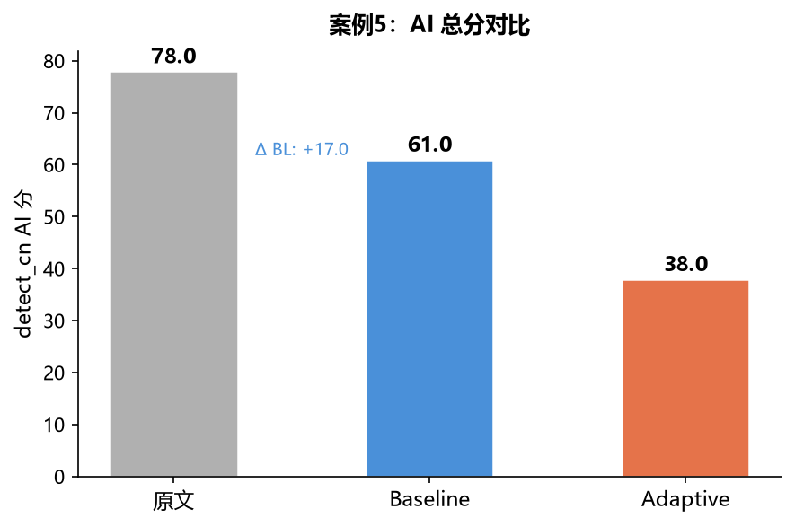

### 关键维度分数对比


### 各维度改善量


### Fast-DetectGPT (Qwen2.5-0.5B) 评分

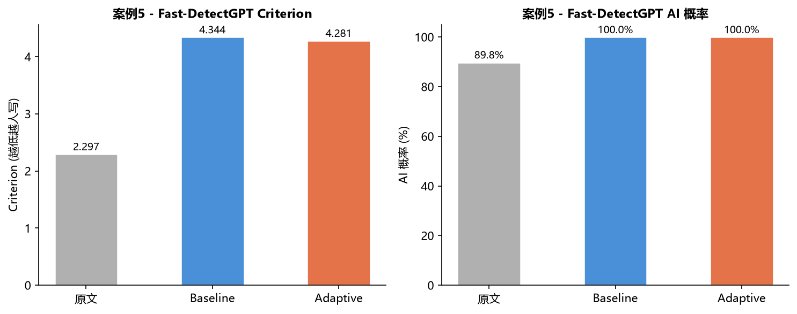

| 版本 | Criterion | AI 概率 |
|------|-----------|---------|
| 原文 | 2.2969 | 89.8% |
| Baseline | 4.3438 | 100.0% |
| Adaptive | 4.2812 | 100.0% |

### 路由策略参数

| 操作 | 参数 | 强度值 |
|------|------|--------|
| 短语替换 | bigram_strength | 0.3500 ███████░░░░░░░░░░░░░ |
| 同义词替换 | strength | 0.4200 ████████░░░░░░░░░░░░ |
| 深层重构 | strength | 0.5100 ██████████░░░░░░░░░░ |
| 深层重构 | delete_prob | 0.4800 █████████░░░░░░░░░░░ |
| 噪声注入 | density | 0.1750 ███░░░░░░░░░░░░░░░░░ |
| 句长随机化 | merge_rate | 0.1750 ███░░░░░░░░░░░░░░░░░ |
| 句长随机化 | truncate_rate | 0.1750 ███░░░░░░░░░░░░░░░░░ |

### 维度分数明细

| 维度 | 原文 | Baseline | Adaptive | BL改善 | AD改善 |
|------|------|----------|----------|--------|--------|
| 句长变异低 | 14.0 | 0.0 | 0.0 | +14.0 | +14.0 |
| 机械连接词 | 8.0 | 0.0 | 0.0 | +8.0 | +8.0 |
| AI高频词 | 8.0 | 4.0 | 4.0 | +4.0 | +4.0 |
| 空洞大词 | 8.0 | 8.0 | 8.0 | +0.0 | +0.0 |
| 情感平淡 | 6.5 | 1.5 | 1.5 | +5.0 | +5.0 |
| 三段式结构 | 4.0 | 0.0 | 0.0 | +4.0 | +4.0 |
| 句式节奏单一 | 0.0 | 2.0 | 2.0 | -2.0 | -2.0 |

### 路由参数明细

| 操作 | bigram_strength | strength | delete_prob | density | merge_rate | truncate_rate |
|------|:-----------:|:------:|:--------:|:-----:|:--------:|:-----------:|
| 短语替换 | 0.35 | - | - | - | - | - |
| 同义词替换 | - | 0.42 | - | - | - | - |
| 深层重构 | - | 0.51 | 0.48 | - | - | - |
| 噪声注入 | - | - | - | 0.175 | - | - |
| 句长随机化 | - | - | - | - | 0.175 | 0.175 |

### 文本片段对比

**原文** (446字):

> 同舟共济：论强者互帮与弱者互撕的文明分野"强者互帮，弱者互撕"这八个字，道尽了人类社会的两种生存状态。强者如江河奔涌，相互滋养；弱者似涸泽之鱼，相濡以沫却终至相争。这不仅是个人命运的写照，更是文明兴衰的密码。翻开人类历史长卷，我们不难发现：那些能够超越丛林法则、建立互助机制的文明，往往能够走得更远；而那些陷入内耗、互相倾轧的群体，则终将被历史的洪流所淘汰。强者互帮，不是简单的道德说教，而是文明存续的必然选择；弱者互撕，也不仅是人性弱点，更是生存困境下的无奈之举。在这个相互依存日益紧密的时代，我们比任何时候都更需要理解互助的价值，打破零和博弈的迷思，共同构建人类命运共同体。互助是人类文明最古老的智慧之一。远古时期，当我们的祖先面对猛兽环伺、自然严酷的生存环境时，正是通过协作狩猎、共享食物才得以延续种族。考古发现表明，尼安德特人虽然体格强壮，却因缺乏有效的协作机制而最终灭绝；而智人则通过语言交流、分工合作，逐渐成为地球的主宰。中国古代的"井田制"、欧洲中世纪的"基尔特"手工业行会，无不体现着互助合作的精神。司马迁在《史记》中记载的管仲与鲍叔牙之交，正是强者互帮的典范——鲍叔牙不计前嫌推荐管

**Baseline** (446字):

> 同舟共济：论强者互帮与弱者互撕的文明分野"强者互帮。弱者互撕"这八个字，道尽了人类社会的两种生存状态。强者如江河奔涌，相互滋养，弱者似涸泽之鱼，相濡以沫却终至相争。这不止是个人命运的写照，更是文明兴衰的密码。翻开人类历史长卷，我们很明显：那些能够超越丛林法则、建立互助机制的文明，往往能够走得更远。而那些陷入内耗、互相倾轧的群体，则终将被历史的洪流所淘汰，强者互帮，不是简单的道德说教，而是文明存续的必然选择，弱者互撕，也不光是人性弱点，更是生存困境下的无奈之举。我觉得，在这个相互依存逐渐紧密的时代，我们比任何时候都更需要理解互助的价值，打破零和博弈的迷思，共同构建人类命运共同体。互助是人类文明最古老的智慧之一，远古时期，当我们的祖先面对猛兽环伺、自然严酷的生存氛围时，正是借助协作狩猎、共享食物才得以延续种族。考古发现表明，尼安德特人即便体格强壮，却因缺乏有效的协作机制而最终灭绝。而智人则经由语言交流、分工合作，逐渐成为地球的主宰，中国古代的"井田制"、欧洲中世纪的"基尔特"手工业行会，无不体现着互助合作的精神。司马迁在《史记》中记载的管仲与鲍叔牙之交，正是强者互帮的典范—鲍叔牙不计前嫌推

**Adaptive** (446字):

> 同舟共济：论强者互帮与弱者互撕的文明分野"强者互帮。弱者互撕"这八个字，道尽了人类社会的两种生存状态。强者如江河奔涌。相互滋养，弱者似涸泽之鱼，相濡以沫却终至相争。我觉得，这不止是个人命运的写照，更是文明兴衰的密码。翻开人类历史长卷。我们很明显：那些足以超越丛林法则、建立互助机制的文明，往往能够走得更远。而那些陷入内耗、互相倾轧的群体。则终将被历史的洪流所淘汰。强者互帮，不是简单的道德说教，而是文明存续的必然选择，弱者互撕，也不光是人性弱点，更是生存困境下的无奈之举。在这个相互依存逐渐紧密的时代，我们比任何时候都更需要理解互助的价值，打破零和博弈的迷思，共同构建人类命运共同体，互助是人类文明最古老的智慧之一。远古时期，当我们的祖先面对猛兽环伺、自然严酷的生存氛围时，正是借助协作狩猎、共享食物才得以延续种族，考古发现反映，尼安德特人即便体格强壮，却因缺乏有效的协作机制而最终灭绝。而智人则经由语言交流、分工合作，逐渐成为地球的主宰。中国古代的"井田制"、欧洲中世纪的"基尔特"手工业行会，无不体现着互助合作的精神，司马迁在《史记》中记载的管仲与鲍叔牙之交，正是强者互帮的典范—鲍叔牙不计前嫌推

---

## 案例 6：句长变异低主导 (AD胜出+18)

- **来源**: HC3 | **字数**: 239 | **种子**: 42

- **原文 AI 分**: 84.0

- **Baseline 改写后**: 68.0 (Δ +16.0)

- **Adaptive 改写后**: 50.0 (Δ +34.0)

- **问题维度**: 句长变异低, 短句占比低, 逗号密度低

- **Tier**: moderate (cap=0.7)

### AI 总分对比

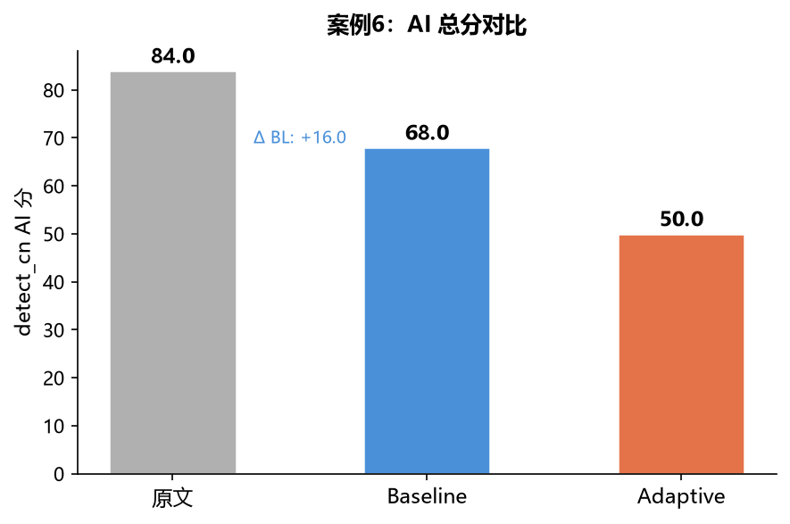

### 关键维度分数对比

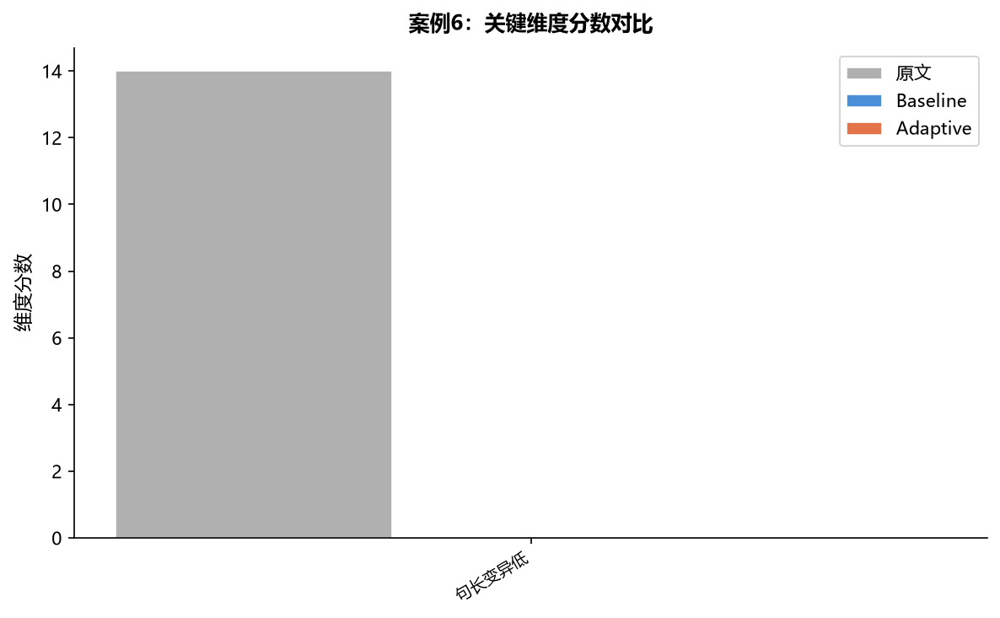

### 各维度改善量

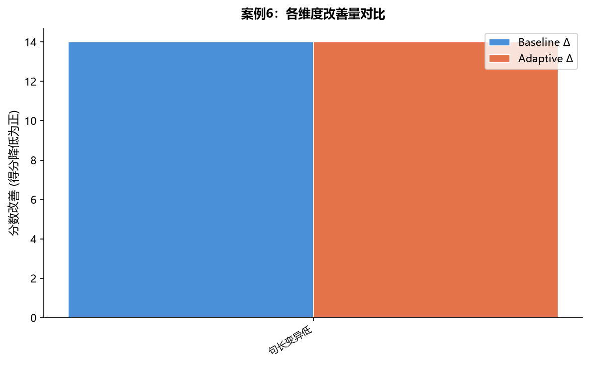

### Fast-DetectGPT (Qwen2.5-0.5B) 评分

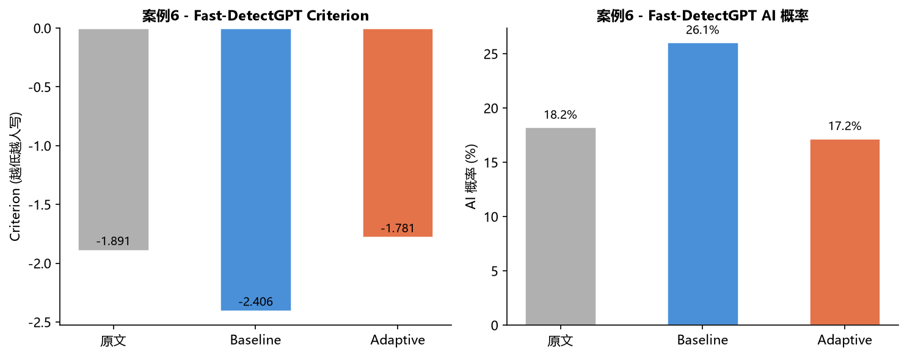

| 版本 | Criterion | AI 概率 |
|------|-----------|---------|
| 原文 | -1.8906 | 18.2% |
| Baseline | -2.4062 | 26.1% |
| Adaptive | -1.7812 | 17.2% |

### 路由策略参数

| 操作 | 参数 | 强度值 |
|------|------|--------|
| 短语替换 | bigram_strength | 0.0000 ░░░░░░░░░░░░░░░░░░░░ |
| 同义词替换 | strength | 0.0000 ░░░░░░░░░░░░░░░░░░░░ |
| 深层重构 | strength | 0.5100 ██████████░░░░░░░░░░ |
| 深层重构 | delete_prob | 0.4800 █████████░░░░░░░░░░░ |
| 噪声注入 | density | 0.1750 ███░░░░░░░░░░░░░░░░░ |
| 句长随机化 | merge_rate | 0.1750 ███░░░░░░░░░░░░░░░░░ |
| 句长随机化 | truncate_rate | 0.1750 ███░░░░░░░░░░░░░░░░░ |

### 维度分数明细

| 维度 | 原文 | Baseline | Adaptive | BL改善 | AD改善 |
|------|------|----------|----------|--------|--------|
| 句长变异低 | 14.0 | 0.0 | 0.0 | +14.0 | +14.0 |

### 路由参数明细

| 操作 | bigram_strength | strength | delete_prob | density | merge_rate | truncate_rate |
|------|:-----------:|:------:|:--------:|:-----:|:--------:|:-----------:|
| 短语替换 | 0.0 | - | - | - | - | - |
| 同义词替换 | - | 0.0 | - | - | - | - |
| 深层重构 | - | 0.51 | 0.48 | - | - | - |
| 噪声注入 | - | - | - | 0.175 | - | - |
| 句长随机化 | - | - | - | - | 0.175 | 0.175 |

### 文本片段对比

**原文** (239字):

> 肝硬化和脾大是两种不同的疾病。肝硬化是指肝脏受损后，组织发生变化，导致肝脏增厚、变硬，并且功能下降的病症。脾大是指脾脏体积增大的病症。\n\n如果您的年纪不算老，但是已经出现了肝硬化和脾大的症状，建议您尽快就医，进行详细的检查和治疗。对于肝硬化和脾大的治疗，具体的方法取决于您的具体病情。通常来说，医生会根据您的病情，制定个性化的治疗方案，可能包括药物治疗、手术治疗等。\n\n在接受治疗的同时，也需要注意生活方式的改变。这些生活方式改变可能包括饮食控制、锻炼身体、戒烟限酒、减轻工作和生活压力等。这些改变可以帮助您维护健康，并有助于治疗的效果。

**Baseline** (232字):

> 肝硬化和脾大是两种不同的疾病。肝硬化是指肝脏受损后，组织发生变化，导致肝脏增厚、变硬，功能下降的病症。脾大是指脾脏体积增大的病症。\n\n假如您的年纪不算老，但是已出现了肝硬化和脾大的症状，建议尽快就医，进行详细的检查和治疗。对于肝硬化和脾大的治疗，具体的手段要看您的具体病情。一般来讲，医生会根据您的病情，制定个性化的治疗方案，可能包括药物治疗、手术治疗等，\n\n在接受治疗的同时，也尤需留心生活方式的扭转。这些生活方式改变可能包括饮食控制、锻炼身体、戒烟限酒、减轻工作和生活压力等。这些改变能帮您维护健康，并有助于治疗的效果。

**Adaptive** (233字):

> 肝硬化和脾大是两种不同的疾病。肝硬化是指肝脏受损后，组织发生变化，导致肝脏增厚、变硬，功能下降的病症。脾大是指脾脏体积增大的病症。\n\n假如您的年纪不算老，但是已经出现了肝硬化和脾大的症状，建议尽快就医，进行详细的检查和治疗，对于肝硬化和脾大的治疗，具体的方法要看您的具体病情。一般来讲，医生会根据您的病情，制定个性化的治疗方案，可能包括药物治疗、手术治疗等。\n\n在接受治疗的同时，也尤需留心生活方式的改变。这些生活方式改变可能包括饮食控制、锻炼身体、戒烟限酒、减轻工作和生活压力等，这些改变能帮您维护健康，并有助于治疗的效果。


---

# 附录：完整文本对比


## 案例 1：空洞大词主导 (AD胜出+24)

### 原文
```
咀嚼“桑提亚哥”――读海明威《老人与海》月光像薄纱一样洒落在古巴海边，桑提亚哥拖着那条被啃噬得只剩下巨大骨架的马林鱼，慢慢走上沙滩。大鱼的骨架在月光下泛着惨白而坚硬的寒光，如同一座荒凉的凯旋门，也像一具被时间啃噬得只剩下精神的骨架标本。海明威笔下的桑提亚哥，正如同这具鱼骨，他血肉饱满的搏斗经历被“鲨鱼”撕咬殆尽，但恰恰是那被噬尽后的骨架，在月光下愈发显出一种清癯、坚硬的轮廓，以一种近乎残酷的方式，向我们袒露出人类精神的脊梁。桑提亚哥的“失败”，是一曲壮阔雄浑的英雄咏叹。八十四天一无所获，八十七天出海，历经日夜鏖战拖回的大鱼，最终只剩一副巨骨——这些冰冷的数字与结局，仿佛在为他刻下失败的墓志铭。然而，海明威以简洁如刀锋的笔触，剖开了失败的表层。老人那双被钓索勒得血肉模糊的手，那双像海水一样深蓝、带着永不屈服神采的眼睛，那一次次忍受剧痛依旧将鱼叉刺入鲨鱼头颅的执着——这一切都在无声宣告：他内在的城池从未陷落。老人与马林鱼的对峙与搏杀，是力与美的交响，是尊严与坚韧的史诗。当桑提亚哥最终说：“一个人可以被毁灭，但不能被打败”时，这句朴素箴言如金石般掷地有声。它宣告着真正的胜利——不是对马林鱼的捕获，而是个体精神面对不可测海洋般命运时，那种独立而坚韧的不屈姿态。他带回来的，早已不是鱼的尸体，而是从苦难深渊中打捞起的、闪闪发光的“人”的尊严。咀嚼桑提亚哥，我恍然惊觉，那看似徒劳的搏斗，其价值恰在于搏斗本身这神圣的仪式。桑提亚哥拖回的骨架，是一曲关于“过程”的辉煌颂歌，昭示着生命意义并非系于可见的终点。老人孤独航行在无垠的海上，与鱼相持，与鲨搏杀，他的每一次拉紧钓索，每一次疲惫欲死却又挣扎清醒，每一次在剧痛中积蓄力量奋力刺出鱼叉，都是生命之火熊熊燃烧的高光时刻。海明威以惊人的冷静笔触，让读者逼真感受到老人手掌被钓索割裂的剧痛、肩背肌肉的撕裂、与巨大马林鱼角力时的精疲力竭。这细致入微的描写，并非为了展示苦难，而是为了照亮那在绝境中依旧选择搏斗的意志光芒。这光芒如此纯粹，超越了物质层面的得失计较。桑提亚哥最终梦见了狮子——那象征原始力量和尊严的图腾，在老人疲惫却安宁的梦中重现。海明威以此隐喻，那浴血搏斗的过程，本身即是灵魂的淬炼与升华。当世俗目光叹息于鱼获尽失，真正的价值早已在惊涛骇浪的“仪式”中被锻造和加冕，如同熔炉中百炼成钢。桑提亚哥的形象，并非只属于小说，它更是海明威为所有在命运风暴中挣扎的灵魂，奋力锻造的一副精神骨架。这份骨架，轻盈而坚硬，在风雨飘摇的人世间，成为足以支撑我们昂首挺立的脊梁。当老人孤独地驶向更远的海域，他不仅仅是在追寻一条鱼，更是在对抗生命本质的虚无与荒诞。海明威以老人的身影，摹刻出人类面对存在深渊时的一种可能姿态：明知世界可能冰冷如海，明知努力可能化为泡影，依旧选择扬起风帆，去战斗，去守护内心那片不容侵蚀的领地。这份悲壮的选择，赋予存在本身以沉重的分量。桑提亚哥的形象，也因此具有了超越时空的普遍性，成为每一个在困顿中坚守者的精神镜像。他提醒我们，真正的力量，不在于征服外在，而在于灵魂深处那不可摧毁的堡垒——那份即使被生活啃噬得只剩下一副骨架，依旧能支撑我们不跪着行走的精神钙质。海明威的伟大，正在于他敢于剥开成功的幻象，用桑提亚哥的“失败”骨架，为我们支撑起一片关于勇气与尊严的天空。当桑提亚哥疲惫归来，当游客们将巨大的马林鱼骨误认为鲨鱼骨架，老人早已沉沉睡去，只有孩子马诺林守候在他身边，泪流满面却眼神坚定——这个结尾如同一个庄重的隐喻。世人或许永远无法真正理解那具骨架所承载的千钧重量，如同游客将马林鱼骨误认为鲨鱼骨，将英雄的勋章误读为失败的耻辱。然而，总会有清澈的眼睛，能穿透表象的迷雾，认出那骨架内部燃烧的火光与不屈的脊梁。孩子马诺林，正是这精神火种的传递者，他的泪水与决心，证明着那骨架所象征的勇气与尊严，已在新的生命中生根发芽。桑提亚哥的骨架，最终成为了一座无言的灯塔，它矗立在人性的海岸线上，以其纯粹的硬度与高度，照亮所有后来者的航程，提醒我们：纵然被命运啃噬得只剩一副骨架，也要让那骨头挺立如桅杆，在生命的怒海上，永不降下尊严的风帆。咀嚼桑提亚哥，如同含着一枚橄榄，初尝是苦涩的海水与失败的咸腥，而后，一种属于灵魂的钙质，一种关于存在的坚硬滋味，在唇齿间、在心魂深处，缓缓沉淀下来，成为支撑我们穿越各自人生之海的、永不风化的骨骼。
```

### Baseline 改写
```
咀嚼“桑提亚哥”――读海明威《老人与海》月光像薄纱一样洒落在古巴海边，桑提亚哥拖着那条被啃噬得只剩下巨大骨架的马林鱼，慢慢走上沙滩。大鱼的骨架在月光下泛着惨白而坚硬的寒光，如同一座荒凉的凯旋门，也像一具被时间啃噬得只剩下精神的骨架标本，海明威笔下的桑提亚哥，正如同这具鱼骨，他血肉饱满的搏斗经历被“鲨鱼”撕咬殆尽，但恰恰是那被噬尽后的骨架。在月光下愈发显出一种清癯、坚硬的轮廓，以一种近乎残酷的方式，向我们袒露出人类精神的脊梁。桑提亚哥的“失败”，是一曲壮阔雄浑的英雄咏叹。八十四天一无所获，八十七天出海，历经日夜鏖战拖回的大鱼，最终只剩一副巨骨—这些冰冷的数字与结局，仿佛在为他刻下失败的墓志铭。话又说回来，海明威以简洁如刀锋的笔触，剖开了失败的表层。老人那双被钓索勒得血肉模糊的手，那双像海水一样深蓝、带着永不屈服神采的眼睛，那一次次忍受剧痛依旧将鱼叉刺入鲨鱼头颅的执着—这一切都在无声宣告：他内在的城池从未陷落。老人与马林鱼的对峙与搏杀，是力与美的交响，是尊严与坚韧的史诗，当桑提亚哥最终说：“一个人可以被毁灭，但不能被打败”时，这句朴素箴言如金石般掷地有声。它宣告着真正的胜利—不是对马林鱼的捕获，而是个体精神面对不可测海洋般命运时，那种独立而坚韧的不屈姿态。他带回来的，早已不是鱼的尸体，而是从苦难深渊中打捞起的、闪闪发光的“人”的尊严，咀嚼桑提亚哥，我恍然惊觉，那看似徒劳的搏斗，其价值恰在于搏斗本身这神圣的仪式。桑提亚哥拖回的骨架，是一曲关于“过程”的辉煌颂歌，昭示着生命意义并非系于可见的终点。老人孤独航行在无垠的海上，与鱼相持，与鲨搏杀，他的每一次拉紧钓索，每一次疲惫欲死却又挣扎清醒，每一次在剧痛中积蓄力量奋力刺出鱼叉，都是生命之火熊熊燃烧的高光时刻。海明威以惊人的冷静笔触，让读者逼真感受到老人手掌被钓索割裂的剧痛、肩背肌肉的撕裂、与巨大马林鱼角力时的精疲力竭。这细致入微的描写，并非为了展示苦难，而是为了照亮那在绝境中依旧选择搏斗的意志光芒。这光芒如此纯粹，超越了物质层面的得失计较，桑提亚哥最终梦见了狮子—那象征原始力量和尊严的图腾，在老人疲惫却安宁的梦中重现。海明威以此隐喻，那浴血搏斗的过程，本身即是灵魂的淬炼与升华。当世俗目光叹息于鱼获尽失，真正的价值早已在惊涛骇浪的“仪式”中被锻造和加冕，如同熔炉中百炼成钢。桑提亚哥的形象，并非只属于小说，它更是海明威为所有在命运风暴中挣扎的灵魂，奋力锻造的一副精神骨架。这份骨架，轻盈而坚硬，在风雨飘摇的人世间，成为足以支撑我们昂首挺立的脊梁，当老人孤独地驶向更远的海域，他不止是在追寻一条鱼，更是在对抗生命本质的虚无与荒诞。海明威以老人的身影，摹刻出人类面对存在深渊时的一种可能姿态：明知世界可能冰冷如海，明知努力可能化为泡影，依旧选定扬起风帆，去战斗，去守护内心那片不容侵蚀的领地，这份悲壮的选择，赋予存在本身以沉重的分量。桑提亚哥的形象，也故而具有了超越时空的普遍性，成为每一个在困顿中坚守者的精神镜像。他提醒我们，真正的力量，不在于征服外在，而在于灵魂深处那不可摧毁的堡垒—那份即使被生活啃噬得只剩下一副骨架，依旧能支撑我们不跪着行走的精神钙质。海明威的伟大，正在于他敢于剥开成功的幻象，用桑提亚哥的“失败”骨架，为我们支撑起一片关于勇气与尊严的天空。当桑提亚哥疲惫归来，当游客们将巨大的马林鱼骨误认为鲨鱼骨架，老人早已沉沉睡去，只有孩子马诺林守候在他身边，泪流满面却眼神坚定—这个结尾如同一个庄重的隐喻。世人或许永远无法真正理解那具骨架所承载的千钧重量，如同游客将马林鱼骨误认为鲨鱼骨，将英雄的勋章误读为失败的耻辱。不过，总会有清澈的眼睛，能穿透表象的迷雾，认出那骨架内部燃烧的火光与不屈的脊梁。孩子马诺林，正是这精神火种的传递者，他的泪水与决心，证明着那骨架所象征的勇气与尊严，已在新的生命中生根发芽。桑提亚哥的骨架，最终成为了一座无言的灯塔，它矗立在人性的海岸线上，以其纯粹的硬度与高度，照亮所有后来者的航程。提醒我们：纵然被命运啃噬得只剩一副骨架。也要让那骨头挺立如桅杆，在生命的怒海上，永不降下尊严的风帆。咀嚼桑提亚哥，如同含着一枚橄榄，初尝是苦涩的海水与失败的咸腥，而后，一种属于灵魂的钙质。一种关于存在的坚硬滋味，在唇齿间、在心魂深处，缓缓积累下来，成为支撑我们穿越各自人生之海的、永不风化的骨骼，影响不小。
```

### Adaptive 改写
```
咀嚼“桑提亚哥”――读海明威《老人与海》月光像薄纱一样洒落在古巴海边，桑提亚哥拖着那条被啃噬得只剩下巨大骨架的马林鱼，慢慢走上沙滩。大鱼的骨架在月光下泛着惨白而坚硬的寒光，如同一座荒凉的凯旋门，也像一具被时间啃噬得只剩下精神的骨架标本，海明威笔下的桑提亚哥，正如同这具鱼骨，他血肉饱满的搏斗经历被“鲨鱼”撕咬殆尽，但恰恰是那被噬尽后的骨架。在月光下愈发显出一种清癯、坚硬的轮廓。以一种近乎残酷的方式，向我们袒露出人类精神的脊梁。桑提亚哥的“失败”，是一曲壮阔雄浑的英雄咏叹。八十四天一无所获，八十七天出海，历经日夜鏖战拖回的大鱼，最终只剩一副巨骨—这些冰冷的数字与结局，仿佛在为他刻下失败的墓志铭。话又说回来，海明威以简洁如刀锋的笔触，剖开了失败的表层。老人那双被钓索勒得血肉模糊的手，那双像海水一样深蓝、带着永不屈服神采的眼睛，那一次次忍受剧痛依旧将鱼叉刺入鲨鱼头颅的执着—这一切都在无声宣告：他内在的城池从未陷落。老人与马林鱼的对峙与搏杀，是力与美的交响，是尊严与坚韧的史诗，当桑提亚哥最终说：“一个人可以被毁灭，但不能被打败”时，这句朴素箴言如金石般掷地有声。它宣告着真正的胜利—不是对马林鱼的捕获，而是个体精神面对不可测海洋般命运时，那种独立而坚韧的不屈姿态，他带回来的，早已不是鱼的尸体，而是从苦难深渊中打捞起的、闪闪发光的“人”的尊严。咀嚼桑提亚哥。我恍然惊觉，那看似徒劳的搏斗，其价值恰在于搏斗本身这神圣的仪式。桑提亚哥拖回的骨架，是一曲关于“过程”的辉煌颂歌，昭示着生命意义并非系于可见的终点。老人孤独航行在无垠的海上，与鱼相持，与鲨搏杀，他的每一次拉紧钓索，每一次疲惫欲死却又挣扎清醒，每一次在剧痛中积蓄力量奋力刺出鱼叉，都是生命之火熊熊燃烧的高光时刻。海明威以惊人的冷静笔触，让读者逼真感受到老人手掌被钓索割裂的剧痛、肩背肌肉的撕裂、与巨大马林鱼角力时的精疲力竭，这细致入微的描写，并非为了展示苦难，而是为了照亮那在绝境中依旧选择搏斗的意志光芒。这光芒如此纯粹，超越了物质层面的得失计较。桑提亚哥最终梦见了狮子—那象征原始力量和尊严的图腾。在老人疲惫却安宁的梦中重现。海明威以此隐喻，那浴血搏斗的过程，本身即是灵魂的淬炼与升华。当世俗目光叹息于鱼获尽失，真正的价值早已在惊涛骇浪的“仪式”中被锻造和加冕，如同熔炉中百炼成钢。桑提亚哥的形象，并非只属于小说，它更是海明威为所有在命运风暴中挣扎的灵魂，奋力锻造的一副精神骨架。这份骨架，轻盈而坚硬，在风雨飘摇的人世间，成为足以支撑我们昂首挺立的脊梁，当老人孤独地驶向更远的海域，他不止是在追寻一条鱼，更是在对抗生命本质的虚无与荒诞。海明威以老人的身影，摹刻出人类面对存在深渊时的一种可能姿态：明知世界可能冰冷如海，明知努力可能化为泡影，依旧选定扬起风帆，去战斗，去守护内心那片不容侵蚀的领地，这份悲壮的选择，赋予存在本身以沉重的分量。桑提亚哥的形象，也故而具有了超越时空的普遍性，成为每一个在困顿中坚守者的精神镜像。他提醒我们，真正的力量，不在于征服外在，而在于灵魂深处那不可摧毁的堡垒—那份即使被生活啃噬得只剩下一副骨架，依旧能支撑我们不跪着行走的精神钙质。海明威的伟大，正在于他敢于剥开成功的幻象，用桑提亚哥的“失败”骨架，为我们支撑起一片关于勇气与尊严的天空。当桑提亚哥疲惫归来，当游客们将巨大的马林鱼骨误认为鲨鱼骨架，老人早已沉沉睡去，只有孩子马诺林守候在他身边，泪流满面却眼神坚定—这个结尾如同一个庄重的隐喻。世人或许永远无法真正理解那具骨架所承载的千钧重量，如同游客将马林鱼骨误主张鲨鱼骨，将英雄的勋章误读为失败的耻辱。不过，总会有清澈的眼睛，能穿透表象的迷雾，认出那骨架内部燃烧的火光与不屈的脊梁。孩子马诺林，正是这精神火种的传递者，他的泪水与决心，证明着那骨架所象征的勇气与尊严，已在新的生命中生根发芽。桑提亚哥的骨架，最终成为了一座无言的灯塔，它矗立在人性的海岸线上，以其纯粹的硬度与高度，照亮所有后来者的航程。提醒我们：纵然被命运啃噬得只剩一副骨架。也要让那骨头挺立如桅杆，在生命的怒海上，永不降下尊严的风帆。咀嚼桑提亚哥，如同含着一枚橄榄，初尝是苦涩的海水与失败的咸腥，而后，一种属于灵魂的钙质，一种关于存在的坚硬滋味，在唇齿间、在心魂深处，缓缓积累下来，成为支撑我们穿越各自人生之海的、永不风化的骨骼。影响不小。
```


## 案例 2：困惑度低主导 (AD胜出+39)

### 原文
```
武汉是中国的一座重要的工业城市，近年来一直保持着较快的发展趋势。武汉的工业基础较为雄厚，有许多大型工业企业和研发机构。随着中国经济的不断发展，武汉的工业发展前景非常看好。

此外，武汉还是一座重要的交通枢纽，位于长江中游，有着优越的地理位置。随着中国的“一带一路”建设的推进，武汉的交通建设也在不断发展，为城市的经济发展提供了更多的机会。

此外，武汉还是一座有着悠久历史文化的城市，拥有众多名胜古迹和文化遗产。武汉的旅游业发展也非常迅速，吸引了越来越多的游客前来旅游观光。

综上所述，武汉在工业、交通、旅游等方面都具有很大的发展潜力。
```

### Baseline 改写
```
武汉是中国的一座重要的工业城市，这几年一直保持着较快的发展趋势。眼下，武汉的工业发展前景非常看好。武汉的工业基础较为雄厚，有许多大型工业企业和研发机构。进展不小。

事情可能并不如表面所示那般简单，需要更细致地审视。

还有，武汉还是一座主要的交通枢纽，位于长江中游，有着优越的地理位置。随着中原的“一带一路”建设的推进，武汉的交通建设也在一再发展，为城市的经济推动提供了更多的机会。

加之，武汉仍旧一座享有悠久历史文化的都会，拥有众多名胜古迹和文化遗产。武汉的旅游业发展也不行迅速，吸引了越来越多的游客前来旅游观光。

说到底，武汉在工业、通畅、国旅等方面都具有很大的发展潜力。
```

### Adaptive 改写
```
武汉是中国的一座重要的工业城市，这几年一直保持着较快的发展趋势。武汉的工业基础较为雄厚。有许多大型工业企业和研发机构。眼下，武汉的工业发展前景非常看好。势头良好。

还有，武汉还是一座主要的交通枢纽，位于长江中游，有着优越的地理位置。随着中原的“一带一路”建设的推进，武汉的交通建设也在一再发展，为都会的经济进展提供了更多的机会。
加之，武汉还是一座有着悠久历史文化的城市，拥有众多名胜古迹和文化遗产，武汉的旅游业推进也万分迅速，吸引了愈加多的游客前来旅游观光。

说到底，武汉在工业、通畅、巡游等方面都具有很大的发展潜力。
```


## 案例 3：中等文本 (AD Δ=+4)

### 原文
```
是的，如果您认为您购买的黄金是18K金但是实际上并不是，或者您对所购买的黄金有其他类似的疑虑，那么您可以考虑退换。然而，您需要向卖家提出退换要求，并且退换是否可以实现可能取决于卖家的退换政策以及您所购买的黄金的情况。建议您与卖家沟通，并在购买之前确认退换政策。
```

### Baseline 改写
```
是的，假如您认为您购买的黄金是18K金但是说真的并不是，或者您对所购买的黄金有其他类似的疑虑，那么您不妨看看退换。话又说回来，您需要向卖家提出退换要求。退换是否可以实现可能要看卖家的退换政策以及您所购买的黄金的情况。建议与卖家沟通，并在购买之前确认退换政策。
```

### Adaptive 改写
```
是的，假如您认为您购买的黄金是18K金但是说真的并不是，或者您对所购买的黄金有其他类似的疑虑，那么您不妨看看退换。话又说回来，您需要向卖家提出退换要求。退换是否可以实现可能要看卖家的退换政策以及您所购买的黄金的情况。建议与卖家沟通，并在购买之前确认退换政策。
```


## 案例 4：AI高频词主导 (持平)

### 原文
```
五菱宏光是一款小型轿车，而秋名山神车是一个俚语，指用五菱宏光改装后行驶在日本秋名山赛道上的车。五菱宏光有较小的体积和较低的价格，在日本很受欢迎，同时也受到了一些车迷的喜爱。有些人将五菱宏光改装成更快的赛车，并在秋名山赛道上进行竞速。这些改装后的五菱宏光被称为秋名山神车。这个俚语已经成为了日本文化的一部分，并在网络上广为流传。
```

### Baseline 改写
```
五菱宏光是一款小型轿车。而秋名山神车是一个俚语，指用五菱宏光改装后行驶在日本秋名山赛道上的车。实事求是地讲，五菱宏光有较小的体积和较低的价格，在日本很受欢迎，同时也受到了一些车迷的喜爱。有些人将五菱宏光改装成更快的赛车，并在秋名山赛道上进行竞速。这些改装后的五菱宏光被称为秋名山神车。这个俚语已成为了日本文化的一部分。并在网络上广为流传。
```

### Adaptive 改写
```
五菱宏光是一款小型轿车。而秋名山神车是一个俚语，指用五菱宏光改装后行驶在日本秋名山赛道上的车。实事求是地讲，五菱宏光有较小的体积和较低的价格，在日本很受欢迎，同时也受到了一些车迷的喜爱。有些人将五菱宏光改装成更快的赛车，并在秋名山赛道上进行竞速。这些改装后的五菱宏光被称为秋名山神车。这个俚语已成为了日本文化的一部分。并在网络上广为流传。
```


## 案例 5：情感平淡主导 (AD胜出+23)

### 原文
```
同舟共济：论强者互帮与弱者互撕的文明分野"强者互帮，弱者互撕"这八个字，道尽了人类社会的两种生存状态。强者如江河奔涌，相互滋养；弱者似涸泽之鱼，相濡以沫却终至相争。这不仅是个人命运的写照，更是文明兴衰的密码。翻开人类历史长卷，我们不难发现：那些能够超越丛林法则、建立互助机制的文明，往往能够走得更远；而那些陷入内耗、互相倾轧的群体，则终将被历史的洪流所淘汰。强者互帮，不是简单的道德说教，而是文明存续的必然选择；弱者互撕，也不仅是人性弱点，更是生存困境下的无奈之举。在这个相互依存日益紧密的时代，我们比任何时候都更需要理解互助的价值，打破零和博弈的迷思，共同构建人类命运共同体。互助是人类文明最古老的智慧之一。远古时期，当我们的祖先面对猛兽环伺、自然严酷的生存环境时，正是通过协作狩猎、共享食物才得以延续种族。考古发现表明，尼安德特人虽然体格强壮，却因缺乏有效的协作机制而最终灭绝；而智人则通过语言交流、分工合作，逐渐成为地球的主宰。中国古代的"井田制"、欧洲中世纪的"基尔特"手工业行会，无不体现着互助合作的精神。司马迁在《史记》中记载的管仲与鲍叔牙之交，正是强者互帮的典范——鲍叔牙不计前嫌推荐管仲为相，管仲则辅佐齐桓公成就霸业，留下"管鲍之交"的千古佳话。这些历史记忆告诉我们：文明从来不是单打独斗的产物，而是无数个体在相互支持中创造的奇迹。当我们将目光投向敦煌莫高窟，那些跨越千年的壁画与雕塑，正是丝路沿线各民族互帮互助、文化交融的见证。然而，人类也常常陷入"弱者互撕"的悲剧循环。鲁迅笔下的"人血馒头"场景，生动展现了弱势群体间的相互伤害；"螃蟹效应"中，一只螃蟹即将爬出竹篓时，总会被其他螃蟹拉回，恰如现实中某些人见不得他人好的心态。法国思想家卢梭曾感叹："人生而自由，却无往不在枷锁之中。"这枷锁很大程度上来自于我们自己对彼此的猜忌与伤害。战国时期，六国面对强秦本应联合自保，却因互相猜忌、各怀鬼胎，最终被各个击破，成为"弱者互撕"导致集体衰亡的典型案例。现代社会中的内卷现象，某种程度上也是这种弱者心态的延续——当资源有限时，人们不是思考如何共同把蛋糕做大，而是陷入无休止的内部竞争中，最终导致整体福祉的下降。这种互撕文化如同文明的腐蚀剂，消解信任，破坏合作，使群体在恶性循环中不断沉沦。从"互撕"到"互帮"的转变，需要超越个人利益的局限，建立更广阔的文明视野。爱因斯坦曾说："人是为其他人而存在的。"这句话揭示了人类存在的本质意义——我们因彼此而完整。古希腊城邦时期的"公益精神"，中国儒家倡导的"己欲立而立人，己欲达而达人"，都指向同一个真理：真正的强者从不怕被别人超越，因为他们懂得在帮助他人的过程中实现自我价值的最大化。北宋思想家张载的"为天地立心，为生民立命"彰显了知识分子的担当；近代实业家张謇弃官从商，以一己之力推动南通现代化，同时培养大批人才，其胸怀与格局至今令人敬仰。在国际层面，二战后的"马歇尔计划"没有将战败的德国置于死地，而是通过援助促进欧洲复兴，最终实现了双赢。这些例证无不说明：当我们将他人视为伙伴而非对手时，就能创造超乎想象的集体智慧与力量。当今世界正面临气候变化、疫情蔓延等全球性挑战，人类比任何时候都更需要超越"互撕"的狭隘，走向"互帮"的文明新阶段。中国提出的"一带一路"倡议，正是这种互助精神的具体实践——通过基础设施互联互通，带动沿线国家共同发展。而在日常生活中，从开源软件的全球协作，到志愿者组织的跨国行动，越来越多的人正在用实际行动证明：互助不仅是道德要求，更是理性选择。法国作家圣埃克苏佩里在《小王子》中写道："真正重要的东西，用眼睛是看不见的。"互助的价值或许无法用短期利益衡量，但它所构建的信任网络与协作机制，却是文明长存的基础。当我们帮助他人成功时，实际上也在为自己的未来投资；当我们分享知识与资源时，也在丰富整个人类的智慧宝库。人类文明的进步史，某种程度上就是从"互撕"走向"互帮"的演化史。从早期部落间的血腥争斗，到现代国家间的合作共赢；从零和博弈的原始思维，到命运共同体的全球共识，我们正在艰难但坚定地向着更高级的文明形态迈进。在这个过程中，每个人都可以成为"强者互帮"文化的践行者——在学术研究中开放共享，在商业竞争中寻求合作，在日常生活中传递善意。古希腊哲学家亚里士多德认为，人是"政治的动物"，其本质在于社会性。这一洞见至今闪耀着真理的光芒：我们因互助而强大，因分裂而脆弱。当越来越多的人选择成为"强者"，拒绝"互撕"的诱惑，人类文明才能真正摆脱霍布斯所描述的"孤独、贫困、肮脏、野蛮与短暂"的自然状态，走向更加光明的未来。
```

### Baseline 改写
```
同舟共济：论强者互帮与弱者互撕的文明分野"强者互帮。弱者互撕"这八个字，道尽了人类社会的两种生存状态。强者如江河奔涌，相互滋养，弱者似涸泽之鱼，相濡以沫却终至相争。这不止是个人命运的写照，更是文明兴衰的密码。翻开人类历史长卷，我们很明显：那些能够超越丛林法则、建立互助机制的文明，往往能够走得更远。而那些陷入内耗、互相倾轧的群体，则终将被历史的洪流所淘汰，强者互帮，不是简单的道德说教，而是文明存续的必然选择，弱者互撕，也不光是人性弱点，更是生存困境下的无奈之举。我觉得，在这个相互依存逐渐紧密的时代，我们比任何时候都更需要理解互助的价值，打破零和博弈的迷思，共同构建人类命运共同体。互助是人类文明最古老的智慧之一，远古时期，当我们的祖先面对猛兽环伺、自然严酷的生存氛围时，正是借助协作狩猎、共享食物才得以延续种族。考古发现表明，尼安德特人即便体格强壮，却因缺乏有效的协作机制而最终灭绝。而智人则经由语言交流、分工合作，逐渐成为地球的主宰，中国古代的"井田制"、欧洲中世纪的"基尔特"手工业行会，无不体现着互助合作的精神。司马迁在《史记》中记载的管仲与鲍叔牙之交，正是强者互帮的典范—鲍叔牙不计前嫌推荐管仲为相，管仲则辅佐齐桓公成就霸业，留下"管鲍之交"的千古佳话。这些历史记忆告诉我们：文明从来不是单打独斗的产物，而是无数个体在相互支持中创造的奇迹。当我们将目光投向敦煌莫高窟，那些跨越千年的壁画与雕塑，正是丝路沿线各民族互帮互助、文化交融的见证。话又说回来，人类也常常陷入"弱者互撕"的悲剧循环。鲁迅笔下的"人血馒头"场景，生动展现了弱势群体间的相互伤害，"螃蟹效应"中，一只螃蟹即将爬出竹篓时，总会被其他螃蟹拉回，恰如现实中某些人见不得他人好的心态。法国思想家卢梭曾感叹："人生而自由，却无往不在枷锁之中。"这枷锁很大程度上来自于我们自己对彼此的猜忌与伤害。战国时期，六国面对强秦本应联合自保，却因互相猜忌、各怀鬼胎，最终被各个击破，成为"弱者互撕"导致集体衰亡的典型案例。现代社会中的内卷现象，某种程度上也是这种弱者心态的延续—当资源有限时，人们不是思考如何共同把蛋糕做大，而是陷入无休止的内部竞争中，最终导致整体福祉的下降。这种互撕文化如同文明的腐蚀剂，消解信任，破坏合作，使群体在恶性循环中一再沉沦，从"互撕"到"互帮"的转变，需要超越个人利益的局限，建立更广阔的文明视野。爱因斯坦曾说："人是为其他人而存在的。"这句话揭示了人类存在的本质意义—我们因彼此而完整。古希腊城邦时期的"公益精神"，中国儒家倡导的"己欲立而立人，己欲达而达人"，都指向同一个真理：真正的强者从不怕被别人超越，因为他们懂得在帮助他人的过程中实现自我价值的最大化。北宋思想家张载的"为天地立心，为生民立命"展现了知识分子的担当。近代实业家张謇弃官从商，以一己之力推动南通现代化，同时培养大批人才，其胸怀与格局至今令人敬仰。在国际层面，二战后的"马歇尔计划"没有将战败的德国置于死地，而是通过援助促进欧洲复兴，最终实现了双赢。这些例证无不说明：当我们将他人视为伙伴而非对手时，就能创造超乎想象的集体智慧与力量。眼下世界正面临气候变化、疫情蔓延等全球性挑战。人类比任何时候都更需要超越"互撕"的狭隘，走向"互帮"的文明新阶段。中国提出的"一带一路"倡议，正是这种互助精神的具体实践—通过基础设施互联互通，带动沿线国家共同推进。而在日常生活中，从开源软件的全球协作，到志愿者组织的跨国行动，越来越多的人正在用实际行动证明：互助不只是道德要求，更是理性选择，法国作家圣埃克苏佩里在《小王子》中写道："真正重要的东西，用眼睛是看不见的。"互助的价值或许无法用短期利益衡量。但它所构建的信任网络与协作机制，却是文明长存的基础。当我们帮助他人成功时，说真的也在为自己的未来投资，当我们分享知识与资源时，也在丰富整个人类的智慧宝库。人类文明的进步史，某种程度上就是从"互撕"走向"互帮"的演化史。从早期部落间的血腥争斗，到现代国家间的合作共赢。从零和博弈的原始思维，到命运共同体的全球共识，我们正在艰难但坚定地向着更高级的文明形态迈进。在这个过程中，每个人都可以成为"强者互帮"文化的践行者—在学术探究中开放共享，在商业竞争中寻求合作，在日常生活中传递善意。古希腊哲学家亚里士多德认为，人是"政治的动物"，其本质在于社会性。这一洞见至今闪耀着真理的光芒：我们因互助而强大，因分裂而脆弱。当越来越多的人选择成为"强者"，拒绝"互撕"的诱惑，人类文明才能真正摆脱霍布斯所描述的"孤独、贫困、肮脏、野蛮与短暂"的自然状态，走向更加光明的未来。势头良好。
```

### Adaptive 改写
```
同舟共济：论强者互帮与弱者互撕的文明分野"强者互帮。弱者互撕"这八个字，道尽了人类社会的两种生存状态。强者如江河奔涌。相互滋养，弱者似涸泽之鱼，相濡以沫却终至相争。我觉得，这不止是个人命运的写照，更是文明兴衰的密码。翻开人类历史长卷。我们很明显：那些足以超越丛林法则、建立互助机制的文明，往往能够走得更远。而那些陷入内耗、互相倾轧的群体。则终将被历史的洪流所淘汰。强者互帮，不是简单的道德说教，而是文明存续的必然选择，弱者互撕，也不光是人性弱点，更是生存困境下的无奈之举。在这个相互依存逐渐紧密的时代，我们比任何时候都更需要理解互助的价值，打破零和博弈的迷思，共同构建人类命运共同体，互助是人类文明最古老的智慧之一。远古时期，当我们的祖先面对猛兽环伺、自然严酷的生存氛围时，正是借助协作狩猎、共享食物才得以延续种族，考古发现反映，尼安德特人即便体格强壮，却因缺乏有效的协作机制而最终灭绝。而智人则经由语言交流、分工合作，逐渐成为地球的主宰。中国古代的"井田制"、欧洲中世纪的"基尔特"手工业行会，无不体现着互助合作的精神，司马迁在《史记》中记载的管仲与鲍叔牙之交，正是强者互帮的典范—鲍叔牙不计前嫌推荐管仲为相，管仲则辅佐齐桓公成就霸业，留下"管鲍之交"的千古佳话。这些历史记忆告诉我们：文明从来不是单打独斗的产物，而是无数个体在相互扶持中创造的奇迹。当我们将目光投向敦煌莫高窟，那些跨越千年的壁画与雕塑，正是丝路沿线各民族互帮互助、文化交融的见证，话又说回来，人类也常常陷入"弱者互撕"的悲剧循环。鲁迅笔下的"人血馒头"场景，生动展现了弱势群体间的相互伤害，"螃蟹效应"中，一只螃蟹即将爬出竹篓时，总会被其他螃蟹拉回，恰如现实中某些人见不得他人好的心态。法国思想家卢梭曾感叹："人生而自由，却无往不在枷锁之中。"这枷锁很大程度上来自于我们自己对彼此的猜忌与伤害，战国时期，六国面对强秦本应联合自保，却因互相猜忌、各怀鬼胎，最终被各个击破，成为"弱者互撕"导致集体衰亡的典型案例。现代社会中的内卷现象，某种程度上也是这种弱者心态的延续—当资源有限时，人们不是思考如何共同把蛋糕做大，而是陷入无休止的内部竞争中，最终导致整体福祉的下降。这种互撕文化如同文明的腐蚀剂。消解信任，破坏合作，使群体在恶性循环中一再沉沦。从"互撕"到"互帮"的转变，需要超越个人利益的局限，建立更广阔的文明视野，爱因斯坦曾说："人是为其他人而存在的。"这句话揭示了人类存在的本质意义—我们因彼此而完整。古希腊城邦时期的"公益精神"，中国儒家倡导的"己欲立而立人，己欲达而达人"，都指向同一个真理：真正的强者从不怕被别人超越，因为他们懂得在帮助他人的过程中达成自我价值的最大化。北宋思想家张载的"为天地立心，为生民立命"展现了知识分子的担当。近代实业家张謇弃官从商，以一己之力推动南通现代化，同样培养大批人才，其胸怀与格局至今令人敬仰。在国际层面，二战后的"马歇尔计划"没有将战败的德国置于死地，而是通过援助促进欧洲复兴，最终实现了双赢。这些例证无不说明：当我们将他人视为伙伴而非对手时，就能创造超乎想象的集体智慧与力量。眼下世界正面临气候变化、疫情蔓延等全球性挑战，人类比任何时候都更需要超越"互撕"的狭隘，走向"互帮"的文明新阶段。中国提出的"一带一路"倡议。正是这种互助精神的具体实践—通过基础设施互联互通，带动沿线国家共同推进。而在日常生活中，从开源软件的全球协作，到志愿者组织的跨国行动，越来越多的人正在用实际行动证明：互助不只是道德要求，更是理性选定。法国作家圣埃克苏佩里在《小王子》中写道："真正重要的东西，用眼睛是看不见的，"互助的价值或许无法用短期利益衡量，但它所构建的信任网络与协作机制，却是文明长存的基础。当我们帮助他人成功时，说真的也在为自己的未来投资，当我们分享知识与资源时，也在丰富整个人类的智慧宝库，人类文明的进步史，某种程度上就是从"互撕"走向"互帮"的演化史。从早期部落间的血腥争斗，到现代国家间的合作共赢，从零和博弈的原始思维，到命运共同体的全球共识，我们正在艰难但坚定地向着更高级的文明形态迈进。在这个过程中，每个人都可以成为"强者互帮"文化的践行者—在学术探究中开放共享，在商业竞争中寻求合作，在日常生活中传递善意。古希腊哲学家亚里士多德认为，人是"政治的动物"，其本质在于社会性。这一洞见至今闪耀着真理的光芒：我们因互助而强大。因分裂而脆弱。当越来越多的人选择成为"强者"，拒绝"互撕"的诱惑，人类文明才能真正摆脱霍布斯所描述的"孤独、贫困、肮脏、野蛮与短暂"的自然状态，走向更加光明的未来。势头良好。
```


## 案例 6：句长变异低主导 (AD胜出+18)

### 原文
```
肝硬化和脾大是两种不同的疾病。肝硬化是指肝脏受损后，组织发生变化，导致肝脏增厚、变硬，并且功能下降的病症。脾大是指脾脏体积增大的病症。\n\n如果您的年纪不算老，但是已经出现了肝硬化和脾大的症状，建议您尽快就医，进行详细的检查和治疗。对于肝硬化和脾大的治疗，具体的方法取决于您的具体病情。通常来说，医生会根据您的病情，制定个性化的治疗方案，可能包括药物治疗、手术治疗等。\n\n在接受治疗的同时，也需要注意生活方式的改变。这些生活方式改变可能包括饮食控制、锻炼身体、戒烟限酒、减轻工作和生活压力等。这些改变可以帮助您维护健康，并有助于治疗的效果。
```

### Baseline 改写
```
肝硬化和脾大是两种不同的疾病。肝硬化是指肝脏受损后，组织发生变化，导致肝脏增厚、变硬，功能下降的病症。脾大是指脾脏体积增大的病症。\n\n假如您的年纪不算老，但是已出现了肝硬化和脾大的症状，建议尽快就医，进行详细的检查和治疗。对于肝硬化和脾大的治疗，具体的手段要看您的具体病情。一般来讲，医生会根据您的病情，制定个性化的治疗方案，可能包括药物治疗、手术治疗等，\n\n在接受治疗的同时，也尤需留心生活方式的扭转。这些生活方式改变可能包括饮食控制、锻炼身体、戒烟限酒、减轻工作和生活压力等。这些改变能帮您维护健康，并有助于治疗的效果。
```

### Adaptive 改写
```
肝硬化和脾大是两种不同的疾病。肝硬化是指肝脏受损后，组织发生变化，导致肝脏增厚、变硬，功能下降的病症。脾大是指脾脏体积增大的病症。\n\n假如您的年纪不算老，但是已经出现了肝硬化和脾大的症状，建议尽快就医，进行详细的检查和治疗，对于肝硬化和脾大的治疗，具体的方法要看您的具体病情。一般来讲，医生会根据您的病情，制定个性化的治疗方案，可能包括药物治疗、手术治疗等。\n\n在接受治疗的同时，也尤需留心生活方式的改变。这些生活方式改变可能包括饮食控制、锻炼身体、戒烟限酒、减轻工作和生活压力等，这些改变能帮您维护健康，并有助于治疗的效果。
```
